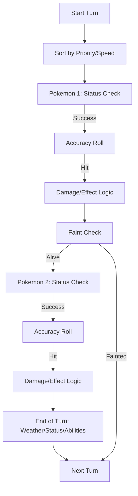

To build a programmatic model of a Pokémon battle, you have to treat the engine as a **top-down state machine**. Even without items or switching, the "Turn" is actually a collection of nested sub-phases.

Here is the technical specification for a 1v1 battle engine turn cycle.

---

## Phase I: Action Sorting (The Pre-Turn)
The engine first determines the **Execution Stack**. This happens before any animations or text.

1.  **Priority Comparison:** Moves are categorized into brackets from $+5$ (e.g., *Protect*) to $-7$ (e.g., *Trick Room*). Higher priority always moves first.
2.  **Speed Calculation:** If priority is equal, the engine calculates the "Effective Speed" for both combatants.
    * $Speed_{Effective} = Base \times StatModifier$
3.  **Speed Tie Resolution:** If $Speed_{Effective}$ is identical, the engine generates a random bit (0 or 1) to determine who occupies the first slot in the stack.

---

## Phase II: The Execution Sub-Loop
The engine processes the stack entry by entry. For each Pokémon's move, it follows this strict sequence:

### 1. Initialization & "Can-Act" Check
The engine checks the internal state of the attacker for "Action Inhibitors":
* **Faint Check:** If HP is 0, the action is skipped.
* **Sleep/Freeze:** If active, the engine rolls to see if the status clears. If not, the action ends.
* **Flinch:** If the `isFlinched` flag is TRUE, the action ends.
* **Paralysis:** A 25% chance to trigger `fullyParalyzed`, ending the action.
* **Confusion:** A 33% chance to skip the move and apply "Self-Hit" damage.

### 2. Move Accuracy Check
The engine pulls the `BaseAccuracy` of the move and compares it against the relative accuracy of the combatants.
* **Calculation:** $Accuracy_{Final} = BaseAccuracy \times \frac{AccuracyMultiplier}{EvasionMultiplier}$
* **Evaluation:** A random integer $R$ (1–100) is generated. If $R > Accuracy_{Final}$, the move fails ("The attack missed!").

### 3. Damage Processing
If the move is "Physical" or "Special," the engine executes the Damage Formula:

$$Damage = \left\lfloor \left( \frac{\left( \frac{2 \times L}{5} + 2 \right) \times P \times \frac{A}{D}}{50} + 2 \right) \times Modifier \right\rfloor$$

**Where $Modifier$ is a product of:**
* **Critical Hit:** A 1.5x multiplier (checked via a 1/24 or 1/16 roll).
* **Random:** A random decimal between $[0.85, 1.00]$.
* **STAB:** 1.5x if the move type matches the user's type.
* **Type Effectiveness:** 0.25x, 0.5x, 1x, 2x, or 4x based on the type chart.

### 4. HP Update & Trigger Events
* **Damage Subtraction:** Target HP is decremented.
* **Faint Check:** If Target HP hits 0, the `isFainted` flag is set and the second actor's turn in the stack is cancelled.
* **Secondary Effects:** The engine rolls for "Added Effects" (e.g., 10% chance to Burn). If successful, the target's `Status` state is updated.

---

## Phase III: The End-of-Turn Phase (Cleanup)
After both stack entries are processed (or skipped), the engine runs a series of "Maintenance" checks in order of the Pokémon’s Speed:

1.  **Weather Effects:** If Sandstorm or Snow is active, apply $1/16$ damage to non-immune types.
2.  **Status Damage:** * **Burn:** Apply $1/16$ max HP damage.
    * **Poison:** Apply $1/8$ max HP damage (or increasing damage for Badly Poisoned).
3.  **Status Expiry:** * Decrement "Confusion" counter.
    * Decrement "Taunt" counter.
    * Decrement "Bound" counter (e.g., *Wrap*).
4.  **Ability Resolution:** Check for end-of-turn abilities like *Speed Boost* or *Shed Skin*.

---

## Logic Flowchart

### Key Internal State Variables
To track this in code, you would need an object for each Pokémon containing:
* `volatileStatus`: (Flinch, Confusion, Taunt) — reset after battle or after X turns.
* `nonVolatileStatus`: (Burn, Paralyze, Sleep, Freeze, Poison) — persists until healed.