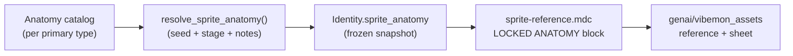

# Sprite Anatomy System

| | |
| --- | --- |
| **Status** | Idea |
| **Priority** | Medium |
| **Complexity** | Medium–High |
| **Area** | Assets / Generation |
| **Related** | [overworld-sprite-rendering.md](overworld-sprite-rendering.md), [generative-aesthetics-and-showcase.md](generative-aesthetics-and-showcase.md), [../ARCHITECTURE.md](../ARCHITECTURE.md) (genai vs workflows) |

## Summary

Persist a resolved **Sprite Anatomy** snapshot per **Vibemon** identity — locomotion class, leg count, posture, constraints — so reference sprites follow locked rules instead of leaving silhouette to the image model. Catalog holds distributions and hard constraints; **Identity** holds outcomes.

## Problem

Reference sprites are generated from `sprite-reference.mdc`, which delegates silhouette to each element's `BODY ARCHETYPE` line in `app/genai/prompts/elements/*.j2`. The image model **chooses** biped vs quadruped vs legless forms on its own. That produces:

- **Unstable silhouettes** across regen (same Vibemon, different leg count).
- **No enforceable distributions** (e.g. NORMAL mammals skewing 55% biped / 35% quadruped / 10% amorphous).
- **No evolution coupling** (later stages should trend more upright without redesigning the creature every pose).
- **Type-specific rules ignored in practice** (marine WATER should never have legs; BUG may be cocoon-like at early stages with 6+ legs later).
- **Dual typing ambiguity** (which element owns locomotion when two types are present?).

Percentages and hard constraints belong in **code**, not prose the model may ignore. The prompt should receive a **locked anatomy brief** the model must follow — similar to how `tier` and `battle_role` already drive includes under `tiers/` and `roles/`, but with explicit stochastic resolution at birth/materialization.

## Concept

Introduce a small, persisted **anatomy snapshot** per **Vibemon** identity, resolved from a typed **catalog** (per primary element, stage, and optional habitat). The snapshot is the single source of truth for sprite reference generation and can later feed sprite sheets, emotes, and showcase copy.

`Anatomy` is intentionally broader than "leg count": the same pipeline can attach other element-driven visual attributes (horn count, wing class, tail length band, exoskeleton vs skin, etc.) without growing **Identity** ad hoc.

## Design

### Architecture flow



### Design principles

1. **Primary element owns locomotion** — matches existing prompt rule: secondary element is accent-only (`sprite-reference.mdc`). `Normal/Fire` uses NORMAL tables; `Fire/Normal` uses FIRE tables.
2. **Catalog holds rules; Identity holds outcomes** — do not store weight matrices on `Identity` (like storing BST curves on every row). Store the resolved snapshot (like `evo_seed`).
3. **Separate locomotion class from posture** — quadruped at stage 1 can become *more upright* at stage 3 without becoming a biped unless metamorphosis rules say so (BUG cocoon → insect).
4. **Deterministic RNG** — use `BirthSeed.rng("sprite.anatomy")` at birth/materialization; reuse `anatomy_seed` on evolution so outcomes are auditable and testable.
5. **Prompt richness without prompt logic** — element `.j2` files keep vibe, palette, and lineage; locked numeric/anatomical facts come from the snapshot rendered into a dedicated include.
6. **Provider/habitat overrides** — some constraints are not elemental (ocean-dwelling WATER). Structured `ProviderNote` codes or provider tags feed the resolver after the type table.

### Anatomy snapshot (persisted)

Suggested fields on `Identity` (and matching DB columns on `identity`):

| Field | Purpose |
| ----- | ------- |
| `anatomy_seed` | Stable int for repro / evolution re-roll namespaces |
| `locomotion` | `biped` \| `quadruped` \| `legless` \| `multiped` \| `aquatic` \| … |
| `leg_count` | Explicit int for the model (`0`, `2`, `4`, `6`, …) |
| `posture` | `low` \| `neutral` \| `upright` — derived from `evo_stage`, may update on evolution |
| `lineage_hint` | Optional creative hint (`mustelid`, `cephalopod`, `cocoon`) — not a hard rule |
| `constraints` | Tuple of prompt-ready forbidden/ required lines |
| `extensions` | JSON bag for future element attributes (horn class, wing span, …) |

`posture` may change when `Vibemon.evo_stage` advances without changing `locomotion` (NORMAL quadruped stays quadruped but stands taller). Metamorphosis lines (BUG) may update `locomotion` and `leg_count` on evolution.

### Catalog & resolver (not on Identity)

### Catalog shape

Per **primary** `VibemonTypeT`, define:

- **Locomotion weights by stage** — e.g. NORMAL: stage 1 → `{biped: 0.55, quadruped: 0.35, legless: 0.10}`; stage 3 → `{0.70, 0.25, 0.05}`.
- **Hard constraints** — marine WATER → `leg_count: 0`; FIGHTING → biped-biased floor.
- **Stage-gated allowed sets** — BUG stage 1 may include `legless` (cocoon); stage 2+ excludes cocoon.
- **Metamorphosis profiles** keyed by `evo_seed` — cocoon line vs nymph line vs always-arthropod.
- **Future attribute slots** — `signature_appendage`, `surface_material`, `size_band`, etc.

Live in `app/genai/sprite_anatomy/catalog.py` or `app/genai/sprite_anatomy/data/{type}.json` (JSON easier for design iteration during beta).

### Resolver

```python
def resolve_sprite_anatomy(
    *,
    elements: IdentityElementsT,
    evo_stage: EvolutionStageT,
    evo_seed: EvolutionStageT,
    provider_notes: tuple[ProviderNote, ...],
    anatomy_seed: int | None = None,
    rng: random.Random | None = None,
) -> SpriteAnatomy:
    ...
```

Resolution order:

1. Load primary-type catalog entry.
2. Apply stage-specific weights; sample `locomotion` (and `leg_count` if implied).
3. Apply `evo_seed` metamorphosis profile (BUG).
4. Apply provider/habitat overrides (e.g. `habitat:marine` → force `leg_count = 0`).
5. Compute `posture` from `evo_stage` (and optionally battle role / tier as soft nudges later).
6. Build `constraints` tuple for the prompt renderer.

Unit tests assert distributions and constraints over many seeds—not image model output.

---

### Example rules (beta tuning)

### NORMAL (terrestrial mammal)

| Stage | Biped | Quadruped | Amorphous (no legs) |
| ----- | ----- | --------- | ------------------- |
| 1 (BASE) | 55% | 35% | 10% |
| 3 (STAGE_3) | 70% | 25% | 5% |

Posture ramps `low` → `neutral` → `upright` by stage. Lineage hints favor mustelid / marsupial / monotreme over cat-dog-rabbit defaults (stays in catalog or `lineage_hint`, not left to the model).

### WATER

| Context | Legs | Locomotion |
| ------- | ---- | ---------- |
| Marine / ocean provider context | 0 | `aquatic` — fish, cephalopod, shell |
| Default freshwater / ambiguous | Catalog TBD in beta | |

Element j2 already says “NOT a land biped”; anatomy makes that **locked** when marine context is detected.

### BUG

| Stage | Allowed locomotion | Notes |
| ----- | ---------------- | ----- |
| 1 | `legless`, `multiped` | Cocoon / larva lines via `evo_seed` |
| 2+ | `multiped` (6+ legs), `quadruped` | No cocoon |

`leg_count` explicit: `0` or `≥6`. Early cocoon is a **metamorphosis** case, not a posture tweak.

---

### Soft reference: Pokémon-type anatomy survey

> **Not canonical for Vibemon.** The table below is an external, hand-estimated survey of main-series Pokémon silhouettes—useful for **beta catalog tuning** and sanity-checking per-type weights. Vibemon catalog entries may diverge (provider habitat, metamorphosis lines, evolution stage curves). Do not copy percentages verbatim without playtesting and resolver tests.
>
> **Leg split legend:** Biped / Quad / **Other** ≈ our `biped` / `quadruped` / everything else (`legless`, `multiped`, `aquatic`, floating, inanimate). **Anatomy irrelevant** = share of species where traditional 2-vs-4 leg logic does not apply; informs how wide the “Other” bucket and provider overrides should be.

| Vibemon type | Dominant stance | Est. leg split | Anatomy irrelevant / undecided zone |
| ------------ | --------------- | -------------- | ------------------------------------- |
| **NORMAL** | Bipedal | ~55% biped \| ~35% quad \| ~10% other | **Low.** Mostly grounded animals. Exceptions: virtual/data (Porygon line), cloud-blobs (Castform). |
| **FIGHTING** | Bipedal | ~90% biped \| ~5% quad \| ~5% other | **Almost none.** Needs limbs to punch/kick. Rare outliers: Falinks (brass spheres). |
| **PSYCHIC** | Bipedal | ~70% biped \| ~15% quad \| ~15% other | **High.** Many floating cosmic objects, bells, symbols (Chimecho, Solrock, Lunatone, Unown)—zero legs. |
| **FLYING** | Bipedal (birds) | ~75% biped \| ~15% quad \| ~10% other | **Medium.** Mostly birds/bats. Irrelevant for cloud-base genies (Tornadus, Thundurus) or Rayquaza. |
| **GHOST** | Bipedal / floating | ~40% biped \| ~10% quad \| ~50% other | **Extremely high.** ~Half are gas, masks, or possessed objects (Gastly, Yamask, Litwick, Sinistea)—legs N/A. |
| **DARK** | Bipedal | ~55% biped \| ~35% quad \| ~10% other | **Low.** Thieves and predators. Mostly irrelevant for shadows (Darkrai, Spiritomb). |
| **FIRE** | Balanced | ~45% biped \| ~45% quad \| ~10% other | **Low.** Terrestrial animals. Irrelevant for plasma/lava (Slugma, Rotom-Heat). |
| **WATER** | Legless / fins | ~30% biped \| ~25% quad \| ~45% other | **Very high.** Fish, sharks, whales, eels (Goldeen, Sharpedo, Wailord)—leg anatomy discarded. |
| **GRASS** | Balanced | ~40% biped \| ~40% quad \| ~20% other | **Medium.** Plants, seeds, vines (Oddish, Cherubi, Tangela, Bramblin)—rooted or spore-floating. |
| **ELECTRIC** | Quadrupedal | ~30% biped \| ~55% quad \| ~15% other | **Medium.** Irrelevant for energy blobs and appliances (Magnemite, Xurkitree, Charjabug, Rotom). |
| **ICE** | Quadrupedal | ~30% biped \| ~55% quad \| ~15% other | **Medium.** Ice structures / snowballs (Cryogonal, Vanillite, Glalie). |
| **POISON** | Legless / slime | ~35% biped \| ~25% quad \| ~40% other | **High.** Slimes, gases, snakes (Grimer, Muk, Koffing, Arbok)—often no legs. |
| **GROUND** | Quadrupedal | ~25% biped \| ~55% quad \| ~20% other | **Medium.** Burrowers (Diglett line), sand-spirits (Silicobra). |
| **ROCK** | Amorphous / quad | ~30% biped \| ~40% quad \| ~30% other | **High.** Boulders, meteorites, gems (Geodude, Minior, Roggenrola)—rudimentary or no legs. |
| **STEEL** | Inanimate / quad | ~25% biped \| ~40% quad \| ~35% other | **High.** Magnets, keys, gears, swords (Klefki, Klinklang, Honedge, Beldum). |
| **BUG** | Multi-legged (6+) | ~15% biped \| ~15% quad \| ~70% other | **Rule-breaker zone.** Traditional 2-vs-4 irrelevant; insects, centipedes, cocoons (Metapod). |
| **DRAGON** | Serpentine / biped | ~45% biped \| ~35% quad \| ~20% other | **Medium.** Legless serpents (Dratini, Dragonair, Rayquaza, Tatsugiri). |
| **FAIRY** | Bipedal | ~70% biped \| ~15% quad \| ~15% other | **Medium.** Humanoids/sprites; floating objects (Comfey, Klefki). |

**How to use during beta**

- Types with **high** irrelevant zones need larger **Other** weights, metamorphosis profiles, or provider-driven overrides—not just biped/quad tuning.
- **BUG** and **GHOST** justify separate locomotion enums (`multiped`, `legless`) rather than forcing quad/biped.
- **WATER** / **POISON** validate marine and slime habitat notes in the resolver before stage weights.
- **FIGHTING** supports a hard biped floor in catalog v1; **NORMAL** row aligns with the proposed 55/35/10 BASE weights above.

---

### Dual typing

| Rule | Behavior |
| ---- | -------- |
| Locomotion table | `elements[0]` only |
| Secondary element | Accent j2 + optional constraint flags (e.g. secondary FLYING allows wings on a quadruped) |
| No blended weights | Do not average NORMAL and FIRE percentages |

Document precedence in the catalog README so beta feedback can target primary-type tables first.

---

### Evolution & `evo_stage`

Two mechanisms (do not conflate):

| Mechanism | When | Example |
| --------- | ---- | ------- |
| **Weight shift** | Re-resolve or re-weight on stage-up | NORMAL more biped at stage 3 |
| **Metamorphosis** | Locomotion class may change | BUG cocoon → adult insect |
| **Posture only** | Same locomotion, taller stance | Quadruped STAGE_3 more upright |

**Inputs:**

- `Identity.evo_seed` — line ceiling / metamorphosis profile (already used for BST scaling).
- `Vibemon.evo_stage` — current form; drives posture and stage-gated BUG rules.

**Workflow hook:** `MaterializeVibemon` (first reference) resolves and persists anatomy. An evolution workflow re-runs resolver with same `anatomy_seed` namespace + new `evo_stage`, applying metamorphosis rules where defined; otherwise updates `posture` only.

---

### Prompt integration

### `sprite-reference.mdc`

After PRIMARY ELEMENT include, inject locked block when `vibemon.identity.sprite_anatomy` is present:

```jinja



```

Replace generic “Choose one simple body plan from the primary element's BODY ARCHETYPE” with “Follow LOCKED ANATOMY; element archetype supplies vibe/palette only.”

### `anatomy/locked.j2` (new)

```text
LOCKED ANATOMY (do not change across poses or regen)
- Locomotion: {{ anatomy.locomotion }}
- Legs: exactly {{ anatomy.leg_count }} — {{ anatomy.leg_description }}
- Posture: {{ anatomy.posture }}

- {{ line }}

```

Element `.j2` files slim down: remove ambiguous BODY ARCHETYPE lists where catalog supersedes them; keep VIBE, VISUAL CUES, PALETTE.

---

### Potential code shapes

### Types (`app/genai/sprite_anatomy/types.py` or `domains/vibemon/types.py`)

```python
class LocomotionT(enum.StrEnum):
    BIPED = "biped"
    QUADRUPED = "quadruped"
    LEGLESS = "legless"
    MULTIPED = "multiped"
    AQUATIC = "aquatic"


class PostureT(enum.StrEnum):
    LOW = "low"
    NEUTRAL = "neutral"
    UPRIGHT = "upright"


class SpriteAnatomy(FrozenSchema):
    anatomy_seed: int
    locomotion: LocomotionT
    leg_count: int = pydantic.Field(ge=0, le=12)
    posture: PostureT = PostureT.NEUTRAL
    lineage_hint: str | None = None
    constraints: tuple[str, ...] = ()
    extensions: dict[str, str | int | bool] = pydantic.Field(default_factory=dict)

    @property
    def leg_description(self) -> str:
        match self.locomotion:
            case LocomotionT.LEGLESS:
                return "no legs; blob, slug, or floating body"
            case LocomotionT.MULTIPED:
                return f"{self.leg_count} segmented legs, grounded"
            case LocomotionT.QUADRUPED:
                return "four legs, grounded, low-slung mammalian"
            case LocomotionT.BIPED:
                return "two legs; arms or forelimbs only if natural for lineage"
            case LocomotionT.AQUATIC:
                return "no walking legs; fins, flukes, or tentacles only"
            case _:
                return f"{self.leg_count} legs"
```

### Catalog entry (`app/genai/sprite_anatomy/catalog.py`)

```python
@dataclass(frozen=True)
class StageLocomotionWeights:
    biped: float = 0.0
    quadruped: float = 0.0
    legless: float = 0.0
    multiped: float = 0.0
    aquatic: float = 0.0

    def normalized(self) -> dict[LocomotionT, float]: ...


@dataclass(frozen=True)
class TypeAnatomyCatalogEntry:
    primary: VibemonTypeT
    by_stage: dict[EvolutionStageT, StageLocomotionWeights]
    leg_count_for: dict[LocomotionT, int | tuple[int, int]]  # multiped -> (6, 8)
    posture_by_stage: dict[EvolutionStageT, PostureT]
    metamorphosis_profiles: dict[EvolutionStageT, frozenset[LocomotionT]] | None = None
    provider_overrides: dict[str, Callable[..., SpriteAnatomy | None]] = ...
    default_constraints: tuple[str, ...] = ()


CATALOG: dict[VibemonTypeT, TypeAnatomyCatalogEntry] = {
    VibemonTypeT.NORMAL: TypeAnatomyCatalogEntry(
        primary=VibemonTypeT.NORMAL,
        by_stage={
            EvolutionStageT.BASE: StageLocomotionWeights(biped=0.55, quadruped=0.35, legless=0.10),
            EvolutionStageT.STAGE_3: StageLocomotionWeights(biped=0.70, quadruped=0.25, legless=0.05),
        },
        leg_count_for={
            LocomotionT.BIPED: 2,
            LocomotionT.QUADRUPED: 4,
            LocomotionT.LEGLESS: 0,
        },
        posture_by_stage={
            EvolutionStageT.BASE: PostureT.LOW,
            EvolutionStageT.STAGE_2: PostureT.NEUTRAL,
            EvolutionStageT.STAGE_3: PostureT.UPRIGHT,
        },
        default_constraints=(
            "Forbidden: humanoid fists, extra legs, detached limbs.",
        ),
    ),
    # WATER, BUG, ...
}
```

### Resolver (`app/genai/sprite_anatomy/resolve.py`)

```python
def resolve_sprite_anatomy(
    *,
    elements: IdentityElementsT,
    evo_stage: EvolutionStageT,
    evo_seed: EvolutionStageT,
    provider_notes: tuple[ProviderNote, ...] = (),
    anatomy_seed: int | None = None,
    rng: random.Random | None = None,
) -> SpriteAnatomy:
    primary = elements[0]
    entry = CATALOG[primary]
    rng = rng or random.Random(anatomy_seed or _derive_seed(elements, evo_stage, evo_seed))

    weights = entry.by_stage.get(evo_stage) or entry.by_stage[EvolutionStageT.BASE]
    locomotion = _weighted_choice(weights.normalized(), rng)

    if override := _provider_override(entry, provider_notes):
        return override

    if allowed := entry.metamorphosis_profiles:
        locomotion = _apply_metamorphosis_gate(locomotion, evo_seed, evo_stage, allowed, rng)

    leg_count = _resolve_leg_count(entry, locomotion, rng)
    posture = entry.posture_by_stage.get(evo_stage, PostureT.NEUTRAL)

    return SpriteAnatomy(
        anatomy_seed=anatomy_seed or rng.randint(0, 2**31 - 1),
        locomotion=locomotion,
        leg_count=leg_count,
        posture=posture,
        constraints=entry.default_constraints,
    )
```

### Identity extension (`app/domains/vibemon/identity.py`)

```python
class Identity(Schema):
    ...
    sprite_anatomy: SpriteAnatomy | None = None  # set at materialize; updated on evolution
```

### Birth / materialize wiring

```python
# affinity.merge or materialize_vibemon — first time anatomy is needed
anatomy = resolve_sprite_anatomy(
    elements=identity.elements,
    evo_stage=vibemon.evo_stage,
    evo_seed=identity.evo_seed,
    provider_notes=Affinity.collect_notes(*affinities),
    rng=birth_seed.rng("sprite.anatomy"),
)
identity = identity.model_copy(update={"sprite_anatomy": anatomy})
```

```python
# genai/vibemon_assets.py
prompt = prompts.render("sprite-reference.mdc", vibemon=vibemon)
# anatomy already on vibemon.identity; template reads vibemon.identity.sprite_anatomy
```

### DB migration (sketch)

```python
# identity table
anatomy_seed: Mapped[int | None]
anatomy_locomotion: Mapped[str | None]
anatomy_leg_count: Mapped[int | None]
anatomy_posture: Mapped[str | None]
anatomy_lineage_hint: Mapped[str | None]
anatomy_constraints: Mapped[list[str] | None]  # JSON
anatomy_extensions: Mapped[dict | None]  # JSON
```

### Tests (`tests/genai/test_sprite_anatomy.py`)

- NORMAL: 10k samples at BASE ≈ 55/35/10 (±ε).
- NORMAL: STAGE_3 shifts toward 70/25/5.
- WATER + `marine` note → always `leg_count == 0`.
- BUG + cocoon `evo_seed` at BASE allows legless; STAGE_2 does not.
- Dual type: `Fire/Normal` uses FIRE catalog, not blended.
- Snapshot render includes `LOCKED ANATOMY` and leg count.

---

### Extending beyond locomotion

The `extensions` bag and catalog slots are reserved for element-driven attributes that should also be locked before image gen:

| Attribute | Example elements | Prompt use |
| --------- | ---------------- | ---------- |
| `wing_class` | FLYING, DRAGON | none / partial / primary flight |
| `horn_count` | DRAGON, NORMAL | 0–2 locked |
| `tail_length` | DRAGON, WATER | short / medium / long band |
| `surface` | BUG, ROCK, STEEL | exoskeleton, mineral, fur |
| `appendage_budget` | Tier (MYTHIC) | ties to tier complexity cap |

Keep **tier** complexity budget in tier j2; anatomy extensions reference the same budget so the model does not add forbidden parts.

### Why not only prompt changes?

| Approach | Outcome |
| -------- | ------- |
| Percentages in `normal.j2` | Soft bias at best; not reproducible; untestable |
| `@property` on `Identity` like `tier` | Missing `evo_stage`, RNG, provider context |
| Full rules on `Identity` | Wrong layer; duplicates catalog |
| **Catalog + snapshot + locked prompt** | Reproducible, testable, evolvable |

## Implementation

### Beta validation plan (with users)

1. **Ship catalog v0** — NORMAL, WATER (marine override), BUG (cocoon line), plus one dual-type smoke (`Grass/Poison` or similar).
2. **Instrument materialize** — log `locomotion`, `leg_count`, `posture`, primary type, `evo_stage` (no PII).
3. **Review queue** — flag reference sprites where matte/sheet QA fails or leg count visibly disagrees with snapshot (manual spot-check).
4. **Feedback prompts** — ask beta trainers: “Does this Vibemon’s body match its type?” (thumbs on reference only).
5. **Iterate weights** — adjust catalog JSON from aggregate distributions and qualitative tags; avoid editing `.mdc` percentages.
6. **Evolution pass** — evolve a small cohort STAGE_1 → STAGE_3; confirm posture shift without sprite-sheet breakage.

### Phases (suggested)

| Phase | Scope |
| ----- | ----- |
| **0** | This doc + catalog schema review with design |
| **1** | Types, resolver, tests; no DB (pass anatomy into prompt only at materialize) |
| **2** | Persist on `Identity` + mapper; locked j2 include |
| **3** | NORMAL / WATER / BUG catalogs; beta logging |
| **4** | Evolution workflow updates anatomy; remaining types |
| **5** | `extensions` attributes (wings, horns, surface) |

## Open Questions

1. **Re-roll on evolution** — NORMAL stage 3: re-sample from shifted weights, or only bump `posture` if stage-1 pick was quadruped?
2. **Freshwater WATER** — separate catalog row or provider note only?
3. **Radiant / mythic** — anatomy extensions only, or separate weight table?
4. **Backfill** — existing **Vibemon** without `sprite_anatomy`: resolve lazily on next materialize from `vibemon.id`, or one-off migration?
5. **Secondary constraint catalog** — worth a small matrix (e.g. FLYING secondary adds wings) in v1 or beta v2?
6. **Provider note codes** — standardize `habitat:marine` vs parsing `provider_visual_notes` free text?

## Success Criteria

Beta exit when:

- ≥90% of spot-checked references match locked `leg_count` / locomotion class.
- NORMAL distribution within ±5% of target weights at BASE and STAGE_3.
- No marine WATER with legs in staged test set.
- Cocoon BUG lines show metamorphosis on evolution without regen drift on unchanged stage.

## References

- `vibemon/backend/app/genai/prompts/sprite-reference.mdc`
- `vibemon/backend/app/genai/prompts/elements/*.j2`
- `vibemon/backend/app/genai/vibemon_assets.py` — `generate_reference_image`
- `vibemon/backend/app/domains/vibemon/identity.py` — `evo_seed`, derived `tier` / `battle_role`
- `vibemon/backend/app/domains/vibemon/entity.py` — `evo_stage`
- `vibemon/backend/app/domains/generation/seed.py` — `rng(namespace)`
- `vibemon/backend/app/workflows/materialize_vibemon.py`
