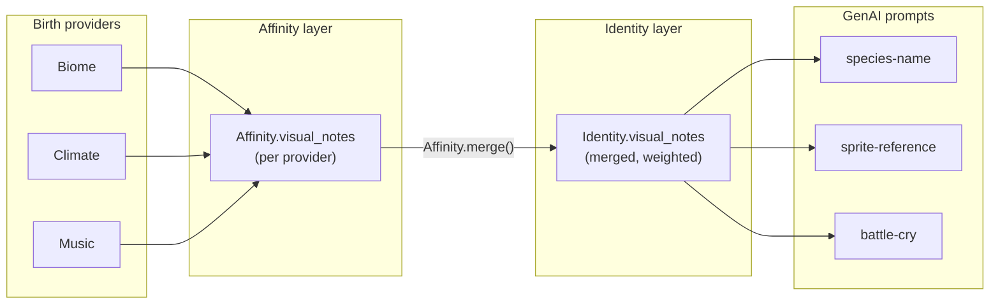

# Affinity-Only Visual Notes Plan

## Goal

Remove trainer/script-authored identity visual notes and rebalance tooling. Visual flavor comes **only** from birth providers via the Affinity layer. On `Identity`, collapse the two note fields into a single `visual_notes` (merged affinity output; drop the `provider_` prefix). No backwards-compatibility path — dev databases are dropped/recreated or manually altered.

## Summary

- Delete `core_identity` / CLI `--idea` from birth, workflows, and dev scripts
- Remove `Identity.visual_notes` (old core-identity column) and rename `provider_visual_notes` → `visual_notes`
- Simplify GenAI prompts and `generate_name()` to read `identity.visual_notes` only
- Delete rebalance workflow, script, and tests (providers are tuned; replay tooling no longer needed)
- Delete `Vibemon.rebirth()` (only caller was rebalance)

## Target data flow



### Field model after change

| Layer | Field | Source | Role |
| :--- | :--- | :--- | :--- |
| Affinity | `visual_notes` | Each birth provider (biome, climate, music) | Per-provider creative seed |
| Identity | `visual_notes` | `Affinity.merge()` | Weighted rollup, e.g. `"clear heat (55%) born in the hum of streets (45%)"` |

**Removed:**

| Removed | Was |
| :--- | :--- |
| `core_identity` / `--idea` | Trainer/script creative seed injected at birth |
| Old `Identity.visual_notes` | Stored copy of `core_identity` |
| `Identity.provider_visual_notes` | Renamed to `visual_notes` |
| Rebalance workflow + script | Dev-only replay of stored snapshots against current provider tuning |
| `Vibemon.rebirth()` | Used only by rebalance |

**Unchanged:**

- `Affinity.visual_notes` on each provider affinity
- Provider `visual_notes()` methods (biome, climate, music)
- `provider_notes` structured codes (`ProviderNote`) — separate from free-text visual notes

---

## Implementation checklist

- [ ] **Phase 1 — Domain:** update `identity.py`, `affinity.py`, `birth.py`, `entity.py` (drop `core_identity`, remove `rebirth`)
- [ ] **Phase 2 — Workflows:** drop `core_identity` from `_workflow_support.py`, `candidate.py`, `generate_wild_supply.py`; delete `rebalance_vibemon.py`
- [ ] **Phase 3 — Scripts:** remove `--idea` from `generate_vibemon.py`, `simulate_adoption.py`; delete `rebalance_vibemon.py`; update `scripts/README.md`
- [ ] **Phase 4 — Storage:** update `models.py` + `mapper.py`; apply SQL or recreate DB
- [ ] **Phase 5 — GenAI:** update `species-name.mdc`, `sprite-reference.mdc`, `battle-cry.mdc`; simplify `vibemon_assets.py` + `materialize_vibemon.py`
- [ ] **Phase 6 — Tests:** delete rebalance tests; update Identity fixtures across ~10 test files; optional merge rollup test in `test_generation_birth.py`
- [ ] **Phase 7 — Docs:** update `sprite-anatomy-system.md` open question wording
- [ ] **Verify:** `rg` for stale symbols; `uv run pytest`; `uv run ruff check .`

---

## Phase 1 — Domain model

### 1.1 [`identity.py`](../../vibemon/backend/app/domains/vibemon/identity.py)

- Remove `visual_notes` (the old core-identity field).
- Rename `provider_visual_notes` → `visual_notes`.
- Result: one nullable field holding merged affinity output.

### 1.2 [`affinity.py`](../../vibemon/backend/app/domains/generation/affinity.py)

In `Affinity.merge()`:

- Remove `core_identity_description` parameter.
- Change identity construction from:

```python
visual_notes=core_identity_description,
provider_visual_notes=" ".join(notes) or None,
```

to:

```python
visual_notes=" ".join(notes) or None,
```

### 1.3 [`birth.py`](../../vibemon/backend/app/domains/generation/birth.py)

- Remove `core_identity` from `birth_outcome_from_affinities()`.
- Stop passing it into `Affinity.merge()`.

### 1.4 [`entity.py`](../../vibemon/backend/app/domains/vibemon/entity.py)

- Remove `core_identity` from `Vibemon.birth()`.
- **Delete** `Vibemon.rebirth()` entirely.

---

## Phase 2 — Workflows

### 2.1 Drop `core_identity` from birth workflows

| File | Change |
| :--- | :--- |
| [`_workflow_support.py`](../../vibemon/backend/app/workflows/_workflow_support.py) | Drop `core_identity` from `birth_and_persist_vibemon()` |
| [`candidate.py`](../../vibemon/backend/app/workflows/candidate.py) | Drop `core_identity` from `generate_candidate()` |
| [`generate_wild_supply.py`](../../vibemon/backend/app/workflows/generate_wild_supply.py) | Drop `core_identity` from `generate_wild_supply()` |

### 2.2 Delete rebalance tooling

| File | Action |
| :--- | :--- |
| [`rebalance_vibemon.py`](../../vibemon/backend/app/workflows/rebalance_vibemon.py) (workflow) | **Delete** |
| [`rebalance_vibemon.py`](../../vibemon/backend/scripts/rebalance_vibemon.py) (script) | **Delete** |
| [`test_rebalance_vibemon.py`](../../vibemon/backend/tests/app/test_rebalance_vibemon.py) | **Delete** |
| [`scripts/README.md`](../../vibemon/backend/scripts/README.md) | Remove rebalance section |

---

## Phase 3 — Dev scripts

### 3.1 [`generate_vibemon.py`](../../vibemon/backend/scripts/generate_vibemon.py)

- Remove `--idea` CLI flag and all `core_identity=` plumbing.
- Keep affinity-only debug output (`affinity.visual_notes` in table/json output) — that stays.

### 3.2 [`simulate_adoption.py`](../../vibemon/backend/scripts/simulate_adoption.py)

- Remove `idea` / `core_identity` parameter threading.

---

## Phase 4 — Storage

### 4.1 [`models.py`](../../vibemon/backend/app/storage/database/models.py) — `Identity` table

- Remove column `visual_notes` (old core-identity column).
- Rename column `provider_visual_notes` → `visual_notes`.

Target shape:

```python
class Identity(Base):
    ...
    visual_notes: Mapped[str | None]   # merged affinity notes only
```

### 4.2 [`mapper.py`](../../vibemon/backend/app/storage/database/mapper.py)

- Read/write single `visual_notes` field; drop both old mappings.

### 4.3 Database apply (no backwards compat)

Project uses `create_all`, not Alembic (see [`infrastructure-plan.md`](infrastructure-plan.md)). For existing dev DBs:

```sql
ALTER TABLE identity DROP COLUMN visual_notes;
ALTER TABLE identity RENAME COLUMN provider_visual_notes TO visual_notes;
```

Or drop and recreate via [`init_db.py`](../../vibemon/backend/scripts/init_db.py) on a disposable database.

---

## Phase 5 — GenAI layer

### 5.1 Prompt templates

| File | Change | Version bump |
| :--- | :--- | :--- |
| [`species-name.mdc`](../../vibemon/backend/app/genai/prompts/species-name.mdc) | Use `identity.visual_notes` only; remove dual-source merge and `visual_notes` template param; update rule text ("Concept / visual notes" → "Concept") | 1.1.1 → 1.2.0 |
| [`sprite-reference.mdc`](../../vibemon/backend/app/genai/prompts/sprite-reference.mdc) | Remove "Personality notes" block; INFLUENCES uses `identity.visual_notes` | 1.1.0 → 1.2.0 |
| [`battle-cry.mdc`](../../vibemon/backend/app/genai/prompts/battle-cry.mdc) | Concept = `identity.visual_notes` only | 1.1.0 → 1.2.0 |

**Before** (`species-name.mdc`):

```jinja

```

**After:**

```jinja

```

(or inline `identity.visual_notes` in the Concept line)

**Before** (`sprite-reference.mdc`):

```jinja

- Personality notes (do not infer anatomy from these): {{ vibemon.identity.visual_notes }}

...

- {{ vibemon.identity.provider_visual_notes }}

```

**After:** single INFLUENCES block using `vibemon.identity.visual_notes`.

### 5.2 [`vibemon_assets.py`](../../vibemon/backend/app/genai/vibemon_assets.py)

Simplify naming API — notes live on identity:

```python
# Before
async def generate_name(self, identity, moves, visual_notes: str | None) -> str:
    prompt = prompts.render("species-name.mdc", identity=identity, moves=moves, visual_notes=visual_notes)

# After
async def generate_name(self, identity, moves) -> str:
    prompt = prompts.render("species-name.mdc", identity=identity, moves=moves)
```

### 5.3 [`materialize_vibemon.py`](../../vibemon/backend/app/workflows/materialize_vibemon.py)

- Update `VibemonAssetGenerator` protocol: drop `visual_notes` param from `generate_name`.
- Christen call becomes:

```python
name = await self._generator.generate_name(vibemon.identity, list(vibemon.moves))
```

---

## Phase 6 — Tests

### 6.1 Delete

- [`test_rebalance_vibemon.py`](../../vibemon/backend/tests/app/test_rebalance_vibemon.py)

### 6.2 Update fixtures

Replace dual-field pattern:

```python
# Before
visual_notes="ember shell",
provider_visual_notes="clear heat",

# After
visual_notes="clear heat (50%)",
```

| File | Notes |
| :--- | :--- |
| [`test_genai_prompts.py`](../../vibemon/backend/tests/app/test_genai_prompts.py) | Single `visual_notes`; update version assertions |
| [`test_vibemon_assets.py`](../../vibemon/backend/tests/app/test_vibemon_assets.py) | Fixture + prompt assertions |
| [`test_materialize_vibemon.py`](../../vibemon/backend/tests/app/test_materialize_vibemon.py) | Mock protocol signature |
| [`test_database_mapper.py`](../../vibemon/backend/tests/storage/test_database_mapper.py) | Round-trip with one field |
| [`test_sprite_assets.py`](../../vibemon/backend/tests/workflows/test_sprite_assets.py) | Identity fixtures |
| [`test_battle_play.py`](../../vibemon/backend/tests/workflows/test_battle_play.py) | Identity fixtures |
| [`test_remaining_workflows.py`](../../vibemon/backend/tests/app/test_remaining_workflows.py) | Identity fixtures |
| [`test_pick_wild_encounter.py`](../../vibemon/backend/tests/app/test_pick_wild_encounter.py) | Identity fixtures |

**Unchanged** (different layer — `Affinity.visual_notes`):

- [`test_biome_provider.py`](../../vibemon/backend/tests/providers/test_biome_provider.py)
- [`test_provider.py`](../../vibemon/backend/tests/app/providers/music/test_provider.py) (music)

### 6.3 Optional new test

Add to [`test_generation_birth.py`](../../vibemon/backend/tests/domains/test_generation_birth.py):

```python
def test_affinity_merge_rollups_visual_notes_with_weights():
    ...
    assert outcome.identity.visual_notes == "fire note (40%) water note (80%)"
```

---

## Phase 7 — Docs touch-up

| File | Change |
| :--- | :--- |
| [`scripts/README.md`](../../vibemon/backend/scripts/README.md) | Remove rebalance references |
| [`sprite-anatomy-system.md`](../ideas/sprite-anatomy-system.md) | Open question: `provider_visual_notes` → `identity.visual_notes` |

No frontend changes — the field was never referenced in Svelte/TS.

---

## Execution order

Do in this order to avoid intermediate broken states:

1. Domain — identity field + affinity merge + birth + remove rebirth
2. Workflows — drop `core_identity`; delete rebalance module
3. Storage — model + mapper
4. GenAI — prompts + vibemon_assets + materialize protocol
5. Scripts — generate_vibemon, simulate_adoption; delete rebalance script
6. Tests — bulk fixture updates; delete rebalance tests
7. DB — SQL alter or recreate
8. Verify

---

## Verification

```bash
# No stale references
rg 'provider_visual_notes|core_identity|rebalance_vibemon|Vibemon\.rebirth' vibemon/backend

# Tests
cd vibemon/backend && uv run pytest

# Lint
cd vibemon/backend && uv run ruff check . && uv run ruff format .
```

**Spot-check behaviors:**

- Generate a Vibemon via script without `--idea`; `identity.visual_notes` is a weighted provider merge.
- Christen: species-name Concept line matches `identity.visual_notes`.
- Sprite reference INFLUENCES section shows the same merged string.
- Rebalance script/workflow gone; no import errors.

---

## Behavioral impacts

| Area | Before | After |
| :--- | :--- | :--- |
| Creative control | Trainer/script could inject `--idea` separate from providers | All visual flavor from birth providers only |
| Rebalance | Preserved stored `visual_notes` as `core_identity` across replay | Tooling removed; no replay path |
| Naming | Concept merged identity + provider notes (+ duplicate param in christen) | Concept = `identity.visual_notes` only |
| Sprites | Separate "Personality notes" + INFLUENCES | Single INFLUENCES block |
| API | `PublicVibemon.identity` exposed both fields | Single `visual_notes` on identity |
| Sparse providers | `--idea` could backfill thin Concept | Moveset tier rules carry more weight when notes are sparse |

---

## Scope explicitly out

- Renaming `Affinity.visual_notes` (already correct layer name)
- Changing merge weight format (`"note (45%)"`) — keep unless a follow-up wants cleaner prose
- `provider_notes` structured codes
- Production Alembic migration — not in repo today
- Renaming merged notes to something other than `visual_notes` on Identity

---

## Estimated diff size

| Category | Files | Action |
| :--- | :--- | :--- |
| Delete | 3 | rebalance workflow, script, test |
| Domain / workflows / scripts | ~12 | edit |
| Storage | 2 | edit |
| GenAI | 4 | edit |
| Tests | ~10 | edit |
| Docs | 2 | edit |

Roughly **~25 files**, mostly mechanical renames and fixture updates.
