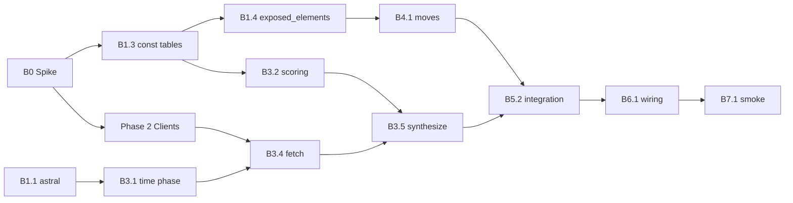

# Biome Provider Plan (Locked)

> Renamed from "Geography Provider" — `CONTEXT.md` already binds "geography" to coordinate-based wild-encounter bucketing. This provider is about the *character of a place*, not its coordinates.

## Goal
Add a second `VibeProvider` that derives a Vibemon's `Affinity` from the **physical place** of birth (biome class, urbanity, time-of-day) rather than the **sky above it**. Runs alongside `ClimateProvider`, never replaces it. Climate owns *atmosphere*; biome owns *place*.

## Why a separate provider, not a climate extension
- Climate signals are *time-varying* (today's weather). Biome signals are *place-invariant* (a desert is a desert in January and July).
- Climate currently overloads its 18 elements with weather proxies for habitat (POISON via pollution, ROCK via elevation). Biome reclaims those habitat assignments directly so climate can focus on atmosphere.
- Two providers means a Vibemon born in a London fog is meaningfully different from one born in Hyde Park on the same foggy day. Biome supplies the *where*, climate supplies the *when*.
- Single-source-of-truth per provider keeps replay, rate limiting, and signal calibration simple.

## Scope
- In scope:
  - New `app/providers/biome/` package mirroring `app/providers/climate/` layout.
  - One concrete `BiomeProvider` subclass of `VibeProvider`.
  - External clients for: Terrascope WMS (ESA WorldCover 2021), Open-Meteo geocoding (population), Open-Meteo elevation. All use existing `LoggingHook` + `RateLimiterHook` plumbing.
  - `astral` added as a backend dependency for local solar-time computation.
  - `data/moves.json` authored via the existing `.agents/SKILLS/vibemon/move-generator` skill — 15 moves per element. Not designed in this plan.
  - Three-stage compositional element scoring (biome class → urbanity scaling → time-of-day bonus).
  - Categorical stat archetype per biome with `+2 / −2 / neutral-2` rule, modulated by urbanity and elevation.
  - Tests under `vibemon/backend/tests/providers/` (mirror climate layout) using captured HTTP fixtures.
  - One-line addition to `rebalance_vibemon`'s default provider tuple.
- Out of scope (v1):
  - Removing or rewriting any climate signal — climate stays untouched.
  - Trainer-selectable provider menus (future direction; this plan only changes the default tuple).
  - Caching layer (biome is place-invariant so a cache would pay off; defer until measured).
  - Lineage UI that distinguishes which provider produced which trait.
  - `provider_visual_notes` aggregation/styling beyond per-biome static strings.

## Locked Decisions
1. **Name**: `BiomeProvider`. `name = "biome"` for `Affinity.provider_id`. No `CONTEXT.md` entry (term is self-explanatory; "geography" reserved for coordinate bucketing).
2. **One provider, broad signals**: natural and built environment in a single class. Amenity-level granularity (graveyard, library, dojo) explicitly rejected — too narrow for "biome".
3. **Three input axes**:
   - **Biome class** (categorical, 11 WorldCover classes) — from Terrascope WMS (`WORLDCOVER_2021_MAP`).
   - **Urbanity** (scalar 0→1, log-scaled population of nearest settlement) — from Open-Meteo geocoding.
   - **Time-of-day** (4 phases: dawn / day / dusk / night) — computed from `BirthSeed.timestamp` + lat/lon via `astral`. Local solar time, not UTC.
4. **No overlap with climate's stat mapping**: climate routes temperature/wind/elevation/radiation/precipitation/wind to the six stats. Biome routes biome-archetype + urbanity-modulator + elevation-modulator to the six stats. Different signals, complementary feel.
5. **Static intensity = 0.5**. Biome is a true peer of climate in `Affinity.merge`'s weighted blend. Time-of-day does not bump intensity (rolled back from an earlier draft); it shifts which *elements* surface, not how loud biome shouts.
6. **`Affinity.merge` handles composition unchanged** — confirmed by reading `app/domains/generation/affinity.py:75-93`. Intensity is per-Affinity, used as a merge weight. No Vibemon-level intensity field exists; nothing to aggregate.
7. **Tie-break side-effect**: merge sorts by `(-intensity, provider_id)`. "biome" precedes "climate" alphabetically, so on intensity ties biome supplies the name slot. Acceptable — biome class names read well as Vibemon-name sources.
8. **No feature flag, no shadow mode**. `BirthSeed.providers` is the replay contract; old seeds replay climate-only, new seeds opt in to biome by including it in their tuple. Default tuple in `rebalance_vibemon` gains `BiomeProvider()` in the same commit that ships the package.
9. **Elevation is re-fetched** by biome, not shared from climate. Providers stay independent. Cost is one extra Open-Meteo call. Biome's Open-Meteo geocoding and elevation clients reuse `provider_name = "open-meteo.weather_forecast"` so they share climate's rate-limit bucket (see locked decision 12).
10. **Moves**: delegated entirely to `.agents/SKILLS/vibemon/move-generator`. 15 moves per element. This plan does not design move content; it commits to the catalog location (`app/providers/biome/data/moves.json`).
11. **`visual_notes`**: static flavored description per biome class. Flat lookup, one string per WorldCover class. No dynamism. (Climate uses `wmo_code.description`; this is the biome analogue.)
12. **Land-cover upstream = Terrascope WMS, not OpenEPI.** Phase 0 research (May 2026) found no OpenEPI WorldCover point-query API. Use Terrascope's public WMS `GetMap` (1×1 PNG) + ESA legend RGB lookup. See *Resolved: land-cover upstream* below.
13. **Geocoding miss → `urbanity = 0.0`.** When reverse geocode returns no settlement, treat as rural wilderness; do not fail the birth.
14. **Offshore / nodata land-cover → `permanent_water`.** WMS transparent pixels (`alpha = 0`) or unmapped RGB map to `WorldCoverClass.PERMANENT_WATER`, not a separate `"unknown"` bucket.

## File Layout

```
vibemon/backend/app/providers/biome/
├── __init__.py
├── api.py             # TerrascopeWorldCoverClient + GeocodingClient + ElevationClient
├── const.py           # WorldCoverClass enum, TimePhase enum, archetype tables,
│                      #   biome-class flavor descriptions
├── provider.py        # BiomeProvider(VibeProvider)
└── data/moves.json    # 15 biome-themed moves per element (generated by skill)
```

Mirrors climate exactly. No new abstractions in `app/providers/`.

## Architecture

### Inputs
`BirthSeed` already carries `geo_coords` and `timestamp`. No seed-shape change.

### Fetch (`async def fetch(seed)`)
Three parallel HTTP calls (matches climate's existing async pattern):

1. **Terrascope WMS land-cover** — 1×1 `GetMap` centered on `seed.geo_coords`. Returns WorldCover 2021 class (one of 11) via RGB legend lookup.
2. **Open-Meteo geocoding** — reverse-geocode `seed.geo_coords` to nearest named place, capture `population` and distance.
3. **Open-Meteo elevation** — point query at `seed.geo_coords`. Returns metres above sea level.

Time-of-day is computed *locally* from `seed.timestamp` + `seed.geo_coords` via `astral`. No API call. Result snapshotted into the payload alongside the API responses.

Full payload (snapshotted for replay determinism):

```python
{
    "worldcover_class": "tree_cover",
    "geocoding": {"population": 12500, "distance_km": 0.8, "name": "..."},
    "elevation_m": 412.0,
    "time_phase": "dawn",  # computed offline from timestamp + coords
}
```

### Synthesize (`async def synthesize(seed, payload)`)
Three-stage element scoring (per Q7 in the design conversation):

```python
def determine_element_scores(biome, time_phase, urbanity, elevation) -> dict:
    score = dict(_BIOME_BASE_WEIGHTS[biome])          # stage 1: biome archetype
    _apply_urbanity_scaling(score, urbanity, elevation)  # stage 2: continuous modulators
    _apply_time_phase_bonus(score, time_phase)        # stage 3: categorical bonus
    return score
```

**Stage 1** — biome class lookup: each WorldCover class has a base element-weight dict (e.g. tree-cover heavily weights GRASS/BUG/GHOST; built-up weights STEEL/POISON/ELECTRIC/DARK).

**Stage 2** — urbanity scales weights *toward* built-environment elements when urbanity is high, *toward* natural elements when low. Elevation amplifies ROCK/ICE/DRAGON/FLYING when high.

**Stage 3** — time-of-day adds flat element bonuses: night → +DARK/+GHOST; dawn → +FAIRY/+PSYCHIC; dusk → +GHOST/+FAIRY; day → +FIRE/+FLYING.

### Stat archetype
Per biome class, a `+2 / −2 / neutral-2` profile. Sketch (refine during implementation):

| WorldCover class | + Stats | − Stats | Neutral |
|---|---|---|---|
| Tree cover (forest) | HP, SpD | SPE, SpA | Atk, Def |
| Grassland | SPE, Atk | Def, SpD | HP, SpA |
| Cropland | HP, Def | Atk, SpA | SpD, SPE |
| Wetland | SpD, SpA | Atk, Def | HP, SPE |
| Permanent water bodies | SpA, SPE | Def, Atk | HP, SpD |
| Bare / sparse vegetation | Atk, SPE | SpD, HP | Def, SpA |
| Snow / ice | Def, SpD | SPE, Atk | HP, SpA |
| Built-up | SPE, SpA | HP, SpD | Atk, Def |
| Shrubland | Atk, Def | SpA, SpD | HP, SPE |
| Mangroves | HP, SpA | SPE, Atk | Def, SpD |
| Moss / lichen | SpD, Def | Atk, SPE | HP, SpA |

Modulators applied on top of the archetype:
- **Urbanity**: ±5–10% shift on built-vs-natural stat pairs (urban → +SPE/+SpA, −HP/−SpD; rural → inverse).
- **Elevation**: ±5–10% shift on Defense and Speed (high → +Def, −SPE).

When the archetype is silent on a stat ("neutral"), default to median with small per-element flavor variance (the Q4 commitment to legibility-over-emergence).

### Intensity
```python
intensity = 0.5  # static
```

That is the entire intensity computation. Per `Affinity.merge` reading: this makes biome a true peer of climate in the weighted blend. When weather is calm, biome dominates the merge; when extreme, climate dominates. Symmetric by design.

### `visual_notes`
Flat lookup per biome class:

```python
_BIOME_FLAVOR: dict[WorldCoverClass, str] = {
    WorldCoverClass.TREE_COVER: "born under a green cathedral of leaves",
    WorldCoverClass.BARE: "born in the wide bone-dry quiet",
    WorldCoverClass.SNOW_ICE: "born where the wind stops being warm",
    # ... one string per class
}
```

No time-of-day or urbanity composition into the string in v1. Identity description stays simple.

## Wiring
`app/workflows/rebalance_vibemon.py:57` — change the default tuple from `(ClimateProvider(),)` to `(ClimateProvider(), BiomeProvider())`. One line. No flag, no setting.

## Data Model
**None.** No schema change. Providers are stateless; `Affinity.provider_id` already exists; `BirthSnapshot` already stores per-provider payloads; `Affinity.merge` already composes multi-provider Affinities into one `BirthOutcome`.

## Dependencies
New backend deps:
- `astral` — local solar-time computation (sunrise/sunset/dawn/dusk timestamps from lat/lon + date). Pure-Python, no native build.

No other deps for land-cover. Terrascope WMS is a plain GET via `niquests.AsyncSession`; PNG decode uses existing `pillow` dep. No `rasterio`, no `boto3`, no `pystac-client`.

## API Source Decisions

- **Terrascope WMS land-cover** (replaces the original OpenEPI assumption — see *Resolved: land-cover upstream*). Chosen over (a) direct AWS S3 COG + `rasterio`/`tifffile`, (b) Microsoft Planetary Computer STAC + titiler, (c) OpenEPI / GFW Data API proxies. Reasons: single unauthenticated GET; no GDAL; official VITO host for ESA WorldCover 2021; fixture-friendly; verified live against Hyde Park, Times Square, Sahara, Greenland, and open ocean. Trade: WMS uptime + legend drift if ESA palette changes. Mitigation: `RetryConfiguration` as climate; parser fails loud on unmapped non-transparent RGB; transparent → `permanent_water`.
- **Open-Meteo geocoding** for urbanity. Population as a log-scaled scalar gives a continuous gradient (50 → 30M) rather than an ordinal city/town/village ladder. Hook `provider_name = "open-meteo.weather_forecast"` (same string as climate) so rate limits are shared.
- **Open-Meteo elevation** re-fetched independently. Provider decoupling is the priority (see locked decision 9). Same `"open-meteo.weather_forecast"` hook name as geocoding and climate.
- **`astral` (local library, not API)** for solar time. Avoids any "sunrise API" dependency; deterministic offline computation; replay-safe.

## Observability
- Reuse `LoggingHook` and `RateLimiterHook` from `app/providers/api_hooks.py`. Hook provider names: `"terrascope.worldcover_wms"`, and `"open-meteo.weather_forecast"` for both geocoding and elevation (shared bucket with climate).
- Log per fetch: WorldCover class, urbanity scalar, time phase. Three small fields, useful for tuning.
- No new metrics beyond what climate already emits.

## Testing
### Unit
- `_BIOME_BASE_WEIGHTS` lookup completeness: every `WorldCoverClass` has an entry; every entry sums element weights consistently.
- Stat archetype table: every biome's `+2 / −2 / neutral-2` profile is internally consistent (no stat appears in both `+` and `−`).
- `_apply_urbanity_scaling`: monotonic in urbanity for built-elements; inverse-monotonic for natural elements; **geocoding miss (`urbanity=0.0`) does not crash.**
- Terrascope WMS parser: every legend RGB maps; **transparent pixel → `PERMANENT_WATER`**; unknown opaque RGB raises.
- `_apply_time_phase_bonus`: every `TimePhase` has a bonus dict; bonuses bounded.
- Time-phase computation via `astral`: known coords + timestamps produce expected phase (test fixtures for equatorial noon, arctic winter, etc.).
- `determine_element_scores` against fixture payloads — one canonical fixture per archetype (forest / wetland / desert / snow / built-up / coast).
- Intensity returns `0.5` regardless of input — single assertion.
- Stat-modulator edge cases: high elevation + urban; low elevation + rural.

### Integration
- Provider runs end-to-end against captured Terrascope WMS + Open-Meteo response fixtures.
- `BirthSeed.fetch_snapshot([ClimateProvider(), BiomeProvider()])` resolves both Affinities, both `provider_id`s persist on the snapshot.
- `Affinity.merge(climate, biome)` produces a `BirthOutcome` with weighted stats and pooled elements/moves; tie-break gives name to biome.
- Replay determinism: same seed + same captured payload → byte-identical Affinity.

### Regression
- Existing climate-only birth tests pass unchanged.
- `rebalance_vibemon` workflow tests updated to assert both providers run.
- `Affinity.merge` behavior with two providers tested explicitly (it has only ever been exercised with one provider in production paths).

## Rollout
1. Land `app/providers/biome/` package, `const.py` archetype tables, `provider.py`, tests, fixtures.
2. Run move-generator skill to populate `data/moves.json` (15 × 18 = 270 moves).
3. Add `BiomeProvider()` to `rebalance_vibemon`'s default provider tuple. One line.
4. Verify in dev against ~20 varied coords (your city, a desert, a glacier, an ocean point, a megacity, deep wilderness, etc.).
5. Tune `_BIOME_BASE_WEIGHTS`, urbanity-scaling factors, and time-phase bonuses based on inspection. Iterate.
6. Ship.
7. **Revisit combined climate + biome balance** — see [Combined provider balance (post-ship follow-up)](#combined-provider-balance-post-ship-follow-up). Climate-only dry-runs are not the target metric once both providers are default.

No staging gate, no flag, no shadow mode. `BirthSeed.providers` provides per-birth replay isolation; old births are unaffected; new births opt in by virtue of using the new default tuple.

## Preconditions

None. Unlike the sound provider, biome needs no seed-shape change, no OAuth, and no trainer linking. `BirthSeed` already carries `geo_coords` and `timestamp`.

## Resolved: land-cover upstream (Open Question 1)

**Verdict: OpenEPI is not a viable WorldCover source.** There is no documented OpenEPI endpoint that returns an ESA WorldCover 2021 class for a lat/lon point. The [OpenEPI developer portal](https://developer.openepi.io/) catalogs weather, geocode, and crop-health APIs; its geospatial how-tos route through the Global Forest Watch Data API for forest datasets (tropical tree cover, natural forests, etc.), not ESA WorldCover. Listing `data-api.globalforestwatch.org/datasets` (May 2026) shows `umd_land_cover` and regional products, but **no ESA WorldCover 2021** with the 11-class FAO taxonomy this plan requires.

**Alternatives evaluated:**

| Source | Verdict |
|---|---|
| OpenEPI / GFW Data API | No ESA WorldCover 2021 dataset; wrong taxonomy even where land-cover exists |
| Copernicus openEO `worldcover_statistics` | Correct data, but OIDC auth + async batch jobs — wrong shape for birth-time `fetch()` |
| AWS public COG (`s3://esa-worldcover/v200/2021/map/…`) + titiler point | Technically works (`GET /cog/point/{lon},{lat}?url=…` returns class code `10`, `50`, etc.), but production titiler is not bundled; full-tile reads without GDAL are ~35s |
| Planetary Computer STAC + data API | STAC search works; PC titiler point endpoints 404 without signing — extra complexity |
| **Terrascope WMS** | **Ship this.** |

**Locked v1 contract — Terrascope WMS 1×1 `GetMap`:**

```
GET https://services.terrascope.be/wms/v2
  ?SERVICE=WMS&VERSION=1.1.1&REQUEST=GetMap
  &LAYERS=WORLDCOVER_2021_MAP&STYLES=worldcover.txt
  &SRS=EPSG:3857
  &BBOX={mercator_x±ε},{mercator_y±ε},{mercator_x±ε},{mercator_y±ε}
  &WIDTH=1&HEIGHT=1&FORMAT=image/png&TIME=2021-12-31
```

- **Auth:** none
- **Response:** 1×1 PNG; center pixel RGB maps to WorldCover code via static ESA legend table in `const.py`
- **Replay payload field:** `worldcover_class` (string enum member, e.g. `"tree_cover"`), not raw RGB
- **Nodata / offshore:** transparent pixel (`alpha = 0`) → `permanent_water` (locked decision 14)
- **Unmapped opaque RGB:** raise / log error (legend drift detector)

**Live verification (May 2026):**

| Location | RGB | Class |
|---|---|---|
| Hyde Park, London | `(0, 100, 0)` | 10 tree_cover |
| Times Square, NYC | `(250, 0, 0)` | 50 built_up |
| Sahara | `(180, 180, 180)` | 60 bare |
| Greenland | `(240, 240, 240)` | 70 snow_ice |
| North Atlantic | `(0, 0, 0)` α=0 | → permanent_water |

Rename client `OpenEPILandCoverClient` → `TerrascopeWorldCoverClient`; hook name `"terrascope.worldcover_wms"`.

## Locked follow-ups (formerly Open Questions 2–4)

2. **Open-Meteo rate-limit bucket sharing — locked.** Reuse `provider_name = "open-meteo.weather_forecast"` on both biome Open-Meteo clients. No `RateLimiterHook` refactor in v1.
3. **Urbanity when geocoding misses — locked.** `urbanity = 0.0`; geocoding sub-payload may be empty or null-population.
4. **Offshore / ambiguous land-cover — locked.** WMS transparent or unmapped nodata → `WorldCoverClass.PERMANENT_WATER` in the persisted payload.

## PR Breakdown (suggested)

| PR | Scope | Ships independently? |
|---|---|---|
| **PR 1 — Spike + fixtures** | Capture Terrascope WMS + Open-Meteo fixtures under `tests/providers/fixtures/biome/` | Yes (fixtures only; land-cover contract now locked) |
| **PR 2 — Provider core** | Phases 1–3 + unit tests for scoring/time-phase | Yes (provider usable in isolation; no default wiring) |
| **PR 3 — Moves + integration** | Phase 4 + Phase 5 integration/regression tests | Yes (needs PR 2) |
| **PR 4 — Wiring + balance** | Phase 6 + Phase 7 smoke/tuning | Yes (needs PR 3; this is the user-visible default change) |

PRs 2 and 3 can merge as one if review surface is small enough; keep Phase 0 fixtures in their own commit either way.

## Implementation Tasks

Tasks are ordered by dependency. **Done when** lists are acceptance criteria, not suggestions.

### Phase 0 — Spike & fixtures (blocking)

| ID | Task | Files / artifacts | Depends | Done when |
|---|---|---|---|---|
| **B0.1** | ~~Verify land-cover upstream.~~ **Done (May 2026).** Contract locked in *Resolved: land-cover upstream* — Terrascope WMS 1×1 `GetMap`. | This plan section | — | *(complete)* |
| **B0.2** | **Capture HTTP fixtures.** Save raw Terrascope WMS PNG bytes (base64 in JSON or `.png` sidecars) plus Open-Meteo JSON. | `vibemon/backend/tests/providers/fixtures/biome/*.json` | B0.1 | Fixtures for forest, built-up, bare, ocean (transparent), snow; filenames document coord + expected class |
| **B0.3** | **Probe Open-Meteo geocoding + elevation.** Confirm reverse-geocode returns `population` and distance; confirm elevation endpoint matches climate's elevation field semantics. | Same fixture dir | — | Fixtures for urban (London), rural (Patagonia), and offshore point |

### Phase 1 — Package foundation

| ID | Task | Files / artifacts | Depends | Done when |
|---|---|---|---|---|
| **B1.1** | Add `astral` dependency. | `vibemon/backend/pyproject.toml`, lockfile | — | `uv sync` succeeds; import works on Windows |
| **B1.2** | Create package skeleton mirroring climate. | `app/providers/biome/__init__.py`, empty `api.py`, `const.py`, `provider.py`, `data/.gitkeep` | B1.1 | Package importable; `BiomeProvider` stub raises `NotImplementedError` on fetch/synthesize |
| **B1.3** | **Author `const.py` tables.** Include `_WORLDCOVER_LEGEND_RGB`, geocoding-miss `urbanity=0.0`, offshore → `PERMANENT_WATER`. | `app/providers/biome/const.py` | B0.1 | `WorldCoverClass` (11 members), `TimePhase` (4), `_BIOME_BASE_WEIGHTS`, stat archetype table, `_TIME_PHASE_BONUSES`, `_BIOME_FLAVOR`, urbanity/elevation modulator constants |
| **B1.4** | **Declare `exposed_elements`.** Follow climate docstring convention in `BiomeProvider`. | `app/providers/biome/provider.py` | B1.3 | Class docstring matches `VibeProvider` convention; `exposed_elements` lists every element biome can surface with signal descriptions |

### Phase 2 — HTTP clients

| ID | Task | Files / artifacts | Depends | Done when |
|---|---|---|---|---|
| **B2.1** | **`TerrascopeWorldCoverClient`.** Build WMS `GetMap` URL (Web Mercator bbox); decode 1×1 PNG; map RGB → `WorldCoverClass`; transparent → `PERMANENT_WATER`. | `app/providers/biome/api.py` | B0.2 | Unit test parses all committed WMS fixtures without network |
| **B2.2** | **`OpenMeteoGeocodingClient`.** Reverse geocode lat/lon; return `{name, population, distance_km}`; compute log-scaled `urbanity`; empty result → `urbanity=0.0`. | `app/providers/biome/api.py` | B0.3 | Fixture test; parser fails loud on missing expected keys |
| **B2.3** | **`OpenMeteoElevationClient`.** Point elevation query; return metres ASL. Hook `provider_name = "open-meteo.weather_forecast"`. | `app/providers/biome/api.py` | B0.3 | Fixture test |
| **B2.4** | ~~Rate-limit bucket decision.~~ **Done.** Both Open-Meteo clients use `"open-meteo.weather_forecast"`. | `app/providers/biome/api.py` | — | Same hook string as `OpenMeteoAPIClient` in climate |

### Phase 3 — Provider logic

| ID | Task | Files / artifacts | Depends | Done when |
|---|---|---|---|---|
| **B3.1** | **`compute_time_phase(timestamp, lat, lon) → TimePhase`.** Use `astral` for local sunrise/sunset; derive dawn/day/dusk/night boundaries. | `app/providers/biome/provider.py` or `const.py` | B1.1, B1.3 | Unit tests: equatorial noon → `day`; high-latitude winter midnight → `night`; boundary timestamps at dawn/dusk |
| **B3.2** | **Element scoring pipeline.** `determine_element_scores()` + `_apply_urbanity_scaling()` + `_apply_time_phase_bonus()`; reuse `filter_element_types` / `pick_starter_moves` from `app/providers/helpers.py`. | `app/providers/biome/provider.py` | B1.3 | Unit tests per Testing section; one canonical fixture per archetype row in stat table |
| **B3.3** | **Stat synthesis.** Map biome archetype `+2/−2/neutral-2` through urbanity + elevation modulators into `Signal`/`base_stat_asymmetric_scaling` (mirror climate's pattern at `climate/provider.py:428-448`). | `app/providers/biome/provider.py` | B1.3, B3.2 | Unit tests for high-elevation+urban and low-elevation+rural edge cases |
| **B3.4** | **`BiomeProvider.fetch()`.** `asyncio.gather` three HTTP calls + local time-phase; return replay-safe payload dict (see Architecture → Fetch). | `app/providers/biome/provider.py` | B2.1–B2.3, B3.1 | Integration test with mocked session returns expected payload shape |
| **B3.5** | **`BiomeProvider.synthesize()`.** Pure replay from payload; `intensity=0.5` always; `visual_notes` from `_BIOME_FLAVOR`; `provider_id="biome"`. | `app/providers/biome/provider.py` | B3.2–B3.4 | Same seed + same payload → byte-identical `Affinity` twice |

### Phase 4 — Move catalog (can start after B1.4)

| ID | Task | Files / artifacts | Depends | Done when |
|---|---|---|---|---|
| **B4.1** | Run **move-generator** skill for biome provider. 15 moves × 18 exposed elements; IDs prefixed `biome.*`. | `app/providers/biome/data/moves.json` | B1.4 | File validates via `Move.model_validate`; flavor matches place-of-birth theme |
| **B4.2** | Move catalog tests mirroring climate. | `tests/providers/test_biome_provider.py` | B4.1, B3.5 | Same assertions as `test_climate_move_catalog_has_fifteen_moves_per_exposed_element` |

### Phase 5 — Tests

| ID | Task | Files / artifacts | Depends | Done when |
|---|---|---|---|---|
| **B5.1** | **Unit tests** for const completeness, scoring monotonicity, time-phase, intensity=0.5. | `tests/providers/test_biome_*.py` | B1.3, B3.1–B3.3 | All cases in Testing → Unit covered |
| **B5.2** | **Integration test** end-to-end with fixtures (no network). | `tests/providers/test_biome_provider.py` | B3.5, B0.2 | `fetch` + `synthesize` on each archetype fixture produces valid `Affinity` |
| **B5.3** | **`Affinity.merge` two-provider test.** Explicit test that climate + biome merge weights stats/elements; tie-break name goes to biome at equal intensity. | `tests/domains/test_generation_birth.py` or new `tests/providers/test_affinity_merge_biome.py` | B3.5 | Assert merge behavior matches `affinity.py:75-93` reading |
| **B5.4** | **Birth snapshot test.** `BirthSeed.fetch_snapshot([ClimateProvider(), BiomeProvider()])` persists both payloads. | `tests/domains/test_generation_birth.py` | B3.4, B3.5 | Both keys in `provider_payloads`; both `provider_id`s on regenerated affinities |
| **B5.5** | **Regression.** Climate-only tests unchanged; rebalance tests updated. | `tests/app/test_rebalance_vibemon.py` | B6.1 | `pytest` green; rebalance test asserts default tuple includes biome when using real providers (or documents fake-provider override) |

### Phase 6 — Wiring

| ID | Task | Files / artifacts | Depends | Done when |
|---|---|---|---|---|
| **B6.1** | **Default provider tuple — rebalance.** | `app/workflows/rebalance_vibemon.py:57` | B3.5, B4.2 | `(ClimateProvider(), BiomeProvider())` is default when `providers=None` |
| **B6.2** | **Default provider tuple — dev scripts.** Rehearsal births should match rebalance defaults. | `scripts/_common.py:birth_seed()` | B6.1 | `generate_vibemon.py` and other script paths birth with both providers |
| **B6.3** | **Optional: extend provider balance analyzer** with biome scenarios (or document deferral). | `.agents/skills/vibemon/provider-balance-analysis/scripts/provider_analysis.py` | B6.1 | Either biome scenarios added or explicit "climate-only analyzer until biome scenarios authored" note in skill |

### Phase 7 — Balance & ship

| ID | Task | Files / artifacts | Depends | Done when |
|---|---|---|---|---|
| **B7.1** | **Manual coord smoke.** ~20 coords from Rollout §4; log WorldCover class, urbanity, time phase, merged elements/stats. | Local dev notes or `docs/development/triage/` entry | B6.2 | No crashes; no all-NORMAL degenerate merges except intentional offshore fallback |
| **B7.2** | **Tune tables.** Adjust `_BIOME_BASE_WEIGHTS`, urbanity scaling, time-phase bonuses from smoke output. | `app/providers/biome/const.py` | B7.1 | Subjective pass: distinct creatures for same-day London fog vs Hyde Park |
| **B7.3** | **Provider balance diff.** Run provider-balance-analysis before/after if biome scenarios exist. Measure **merged** element distribution (`Affinity.merge`), not climate-only rebalance counts. | `.generated/` or triage doc | B7.2 | No unintended climate regression; merged element distribution healthy across varied coords; see [Combined provider balance](#combined-provider-balance-post-ship-follow-up) |
| **B7.4** | **Ship.** Merge PR 4; no feature flag. | — | B5.5, B7.2 | Default births and rebalance both use `(ClimateProvider(), BiomeProvider())` |
| **B7.5** | **Combined balance pass.** Tune biome tables and, if needed, trim climate habitat overlap after inspecting merged births on persisted corpus + ~20 smoke coords. | `app/providers/biome/const.py`, optionally `app/providers/climate/provider.py` | B7.4 | Primary-type distribution assessed on `(ClimateProvider(), BiomeProvider())`; climate slim-down items documented if overlap is redundant |

### Parallel workstreams



**Move catalog (B4)** can run in parallel with **client + synthesize work (B2–B3)** once `exposed_elements` is declared (B1.4). **Phase 0 fixtures (B0)** block all HTTP client work.

## Implementation Checklist (summary)

- [ ] **B0** — Capture Terrascope WMS + Open-Meteo fixtures *(land-cover contract locked)*
- [ ] **B1** — `astral` dep; package skeleton; `const.py` + `exposed_elements`
- [ ] **B2** — Terrascope WMS + Open-Meteo clients *(rate-limit bucket locked)*
- [ ] **B3** — Time phase; element + stat synthesis; `fetch` / `synthesize`
- [ ] **B4** — `data/moves.json` via move-generator; catalog tests
- [ ] **B5** — Unit, integration, merge, snapshot, regression tests
- [ ] **B6** — Wire into `rebalance_vibemon` + `scripts/_common.py`
- [ ] **B7** — Smoke, tune, balance diff, ship, **combined climate + biome balance pass**

## Combined provider balance (post-ship follow-up)

`(ClimateProvider(), BiomeProvider())` is the **default provider tuple** for new births and `rebalance_vibemon`. Element typing and stats come from `Affinity.merge`, which pools each provider's elements and moves by intensity — not from climate alone.

Pre-biome climate tuning (including dry-runs on persisted birth snapshots) remains useful for atmosphere semantics and data-quality fixes, but **it is not the production balance target**. Once biome ships, treat merged births as the source of truth for type ecology.

**Revisit after biome v1 lands:**

1. **Measure merged distribution** — primary and dual-type rates from `rebalance_vibemon` with both providers, plus manual smoke coords (desert, glacier, forest, built-up, coast, etc.). Compare to climate-only rebalance only to detect overlap, not as the ship gate.
2. **Tune biome first** — `_BIOME_BASE_WEIGHTS`, urbanity scaling, and time-phase bonuses own *place* (WorldCover class, elevation, dawn/night). Most habitat gaps climate currently proxies (Grass/Bug from transp, Rock/Ice from elevation, Fairy from UV product, Ground from arid weather) should resolve here.
3. **Trim climate second, if needed** — v1 biome does not rewrite climate signals. Expect temporary double-counting (e.g. mountain + cold day scoring Ice in both providers). After merged inspection, optionally slim climate: drop or weaken habitat paths that biome now owns; keep weather-native paths (precip → Water, wind → Flying, CAPE → Electric, fog WMO → Ghost, heat/radiation → Fire).
4. **Accept honest rarity** — some types stay rare in a given corpus (Fire on humid temperate days, Dragon on lowland births). Combined balance should fix *broken* types (never surfacing when place + sky both support them), not force flat 6% shares per element.

Document findings in `docs/development/triage/` or a before/after provider balance report. Defer further climate-only thresh chasing until this combined pass is complete.

## Notes for Future Expansion
- Trainer-selectable providers per birth (the model the user already has in mind). Biome slots in as one option alongside climate; nothing in the provider package needs to change for that future.
- Caching by geohash precision-7 (~150m). Biome is place-invariant so cache hit rate could be very high. Defer until measured.
- Lineage UI surfacing per-provider contribution ("born in mangrove at dawn under thunderstorm"). Requires `provider_visual_notes` aggregation work, not biome work.
- Direct WorldCover (S3 + `rasterio`) or self-hosted titiler migration if Terrascope WMS uptime becomes a problem. Would be its own ADR; not anticipated for v1.
- GBIF species-occurrence enrichment for true biodiversity-driven BUG/GRASS signals. A separate provider, not a biome extension.
- **Climate habitat slim-down** after combined balance pass (see [Combined provider balance](#combined-provider-balance-post-ship-follow-up)): optional ADR if elevation/transp/UV paths are removed from climate post-biome.
