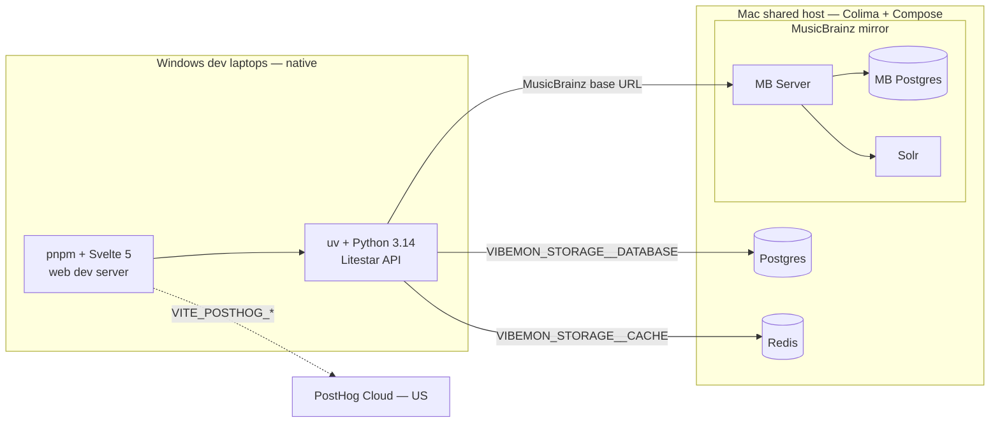
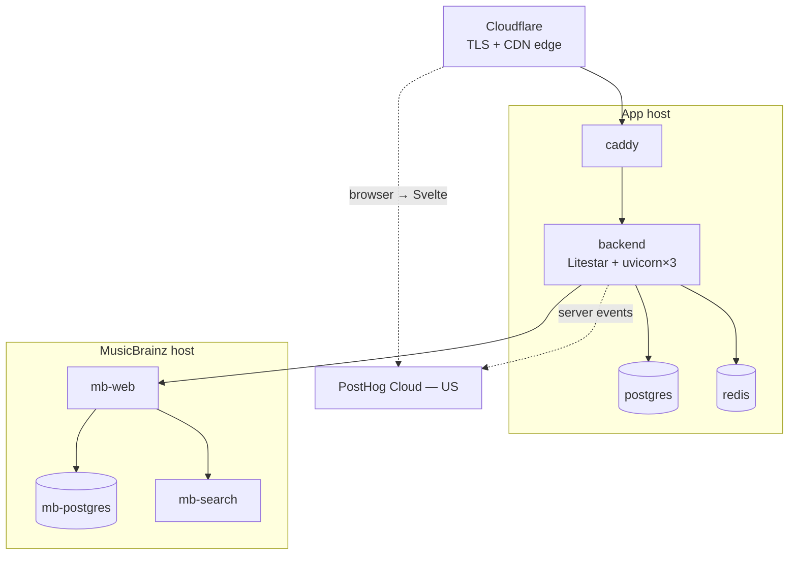

# Infrastructure Plan

## Goal

Move vibemon from local-dev SQLite + on-disk cache to a production-shaped stack: Postgres for app state, Redis for provider response cache, self-hosted MusicBrainz mirror, and PostHog Cloud for analytics. Developers run the app natively on Windows laptops; a shared Mac test/staging server (Colima) runs the infrastructure services in containers. The same compose stacks and env-var wiring roll forward to Linux production with minimal changes.

## Why now

- Provider work lands high-volume HTTP caches that benefit from a shared store across processes, not per-process SQLite. The `niquests_cache` SQLiteBackend serialises through one file — fine for one dev, contended once two workers run.
- Postgres ergonomics (JSONB, real timestamptz, `ON CONFLICT`, concurrent writes) become a daily comfort instead of a nice-to-have once we run multi-worker.
- Self-hosted MusicBrainz removes a 25 req/s public-API ceiling that would otherwise cap birth throughput as music lookups become common.
- PostHog Cloud gives us behavioural telemetry from the first user (analytics, session replay, feature flags) without operating ClickHouse/Kafka ourselves. Revisit self-hosting if PII or event volume forces it.
- A two-machine dev model (Windows laptops + shared Mac services host via Colima) closes the gap between "works on my laptop" and "ships". Infra divergences surface on the Mac test box, not in production.

## Scope

**In scope on this plan:**

- Planned-capacity documentation (load model, sizing, growth triggers)
- Target architecture diagram and service inventory
- SQLite → Postgres migration for app DB (`vibemon/backend/app/storage/database/`)
- SQLite → Redis migration for `niquests_cache` provider response caches
- Two-machine development model (Windows dev laptops + Mac shared services host)
- PostHog Cloud integration (frontend SDK; backend SDK optional)
- Mac test/staging deployment via Colima with Docker Compose
- Mac-vs-Linux divergence notes (file paths, networking, virt, perf)
- Path from dev/test to Linux production (env-driven, same compose stacks)

**Out of scope:**

- Cloud provider selection beyond a recommendation (covered in Deployment Targets but final choice deferred to launch)
- Frontend deployment specifics (separate Svelte plan)
- Self-hosted MusicBrainz tuning beyond what this plan needs (full guide lives separately under `docs/development/runbooks/` once written)
- Auth / OAuth hardening (separate concern)
- Logs and metrics infrastructure beyond PostHog (Prometheus / Loki / Grafana deferred to a follow-up plan)
- **Schema migration tooling (Alembic).** Deferred to the v1.0 gate. While pre-1.0 we evolve schema by `Base.metadata.create_all()` + manual drop-and-rebuild on dev databases. See *Schema management (pre-1.0)* below.

## Locked decisions

1. **Postgres 16** for app DB. Async driver `asyncpg` via SQLAlchemy 2.0 async.
2. **Redis 7** (or Valkey 8) for cache. `appendonly no`, `maxmemory-policy allkeys-lru`. Cache is regenerable, durability not required.
3. **MusicBrainz self-hosted, frozen-dump model.** No hourly replication in v1. Quarterly `fetch-dump.sh` re-import via scheduled job. Justified by `/recording` use case + 30-day client-side cache TTL.
4. **PostHog Cloud** (free tier, US region). Frontend sends events via `posthog-js`; backend may emit authoritative events via the Python SDK later. No self-hosted PostHog stack in v1. Revisit if PII handling or event volume exceeds the free tier.
5. **Docker Compose** as the orchestration surface for Mac test/staging and Linux prod. No Kubernetes. Compose files under `deploy/` are the single source of service topology.
6. **Two owned hosts in v1**: app host (backend + Postgres + Redis + Caddy), MusicBrainz host. PostHog is external SaaS. Split further only on observed pressure.
7. **Mac test/staging server uses Colima** with `vz` driver and `virtiofs` mounts. No Docker Desktop. Not Podman — Colima is already proven on this hardware ([voxbot Mac deploy](https://github.com/boonhapus/voxbot/tree/main/deploy/macos)); Podman on Mac still runs a VM and does not simplify the workflow. Linux prod uses Docker Engine + the same compose files.
8. **Two-machine dev model.** Developers run backend + frontend natively on Windows laptops. Postgres, Redis, and MusicBrainz run as containers on the shared Mac server. Laptops connect via env vars only — no hardcoded hostnames.
9. **Provider cache TTLs unchanged across the SQLite→Redis swap.** Migration is a backend swap, not a semantic change. Cold cache after cutover is acceptable; cache rebuilds from upstream.
10. **No data migration of provider caches.** SQLite cache files are discarded on cutover. They are not source of truth.
11. **App DB migration is one-shot drop + recreate.** Pre-launch we have no production data to preserve. Backend is rebuilt from scratch against a fresh Postgres schema generated by `Base.metadata.create_all()`. Revisit at v1.0.
12. **No Alembic until v1.0.** Schema evolution pre-1.0 is "edit model, drop dev DB, recreate". Trading reproducibility for velocity; the v1.0 gate adopts Alembic with a baseline revision against the then-current schema.
13. **Litestar 2.x** for the game HTTP API ([litestar.dev](https://litestar.dev/)). ASGI server via uvicorn. Not FastAPI.

## Development model

Two machines, one repo, env vars for everything in between.

### What runs where

| Machine | Runs natively | Runs in containers (Colima) |
|---|---|---|
| **Windows dev laptop** | uv + Python 3.14 (Litestar API), Node + pnpm + Svelte 5 (web) | Optional: local Postgres/Redis via Docker Desktop for offline work |
| **Mac shared services host** | Nothing app-related (infra only) | Postgres, Redis, MusicBrainz mirror (MB Server + MB Postgres + Solr) |

| External (SaaS) | Role |
|---|---|
| **PostHog Cloud** (free tier, US) | Product analytics, session replay, feature flags |

### Dev/test topology



Production adds Caddy + containerized backend on the app host, TLS, and Cloudflare at the edge — same services, different `.env`. See [Path to production](#path-to-production).

### How laptops connect

Every endpoint is an env var. A Windows laptop, the Mac test box, and Linux prod differ only in values — no hostnames in code.

| Variable | Points to | Example (laptop → Mac host) |
|---|---|---|
| `VIBEMON_STORAGE__DATABASE` | App Postgres | `postgresql+asyncpg://vibemon:<pw>@192.168.x.x:5432/vibemon` |
| `VIBEMON_STORAGE__CACHE` | Redis | `redis://:<pw>@192.168.x.x:6379/0` |
| `VIBEMON_MUSICBRAINZ__BASE_URL` | MB Server | `http://192.168.x.x:5000/ws/2/` |
| `VITE_POSTHOG_KEY` + `VITE_POSTHOG_HOST` | PostHog Cloud | `https://us.i.posthog.com` |

> Bind Postgres, Redis, and MusicBrainz to the Mac host's LAN address. Set passwords and firewall rules so only trusted clients connect. Never expose unauthenticated Redis.

### Setup: Windows dev laptop

```powershell
# Python toolchain
irm https://astral.sh/uv/install.ps1 | iex
uv python install 3.14

# JS toolchain (Node LTS + corepack)
winget install OpenJS.NodeJS.LTS
corepack enable
corepack prepare pnpm@latest --activate

# Copy and fill repo-root .env (point storage URLs at Mac host or local stacks)
copy .env.example .env

# Run (from repo root)
cd vibemon/backend
uv run dev                    # backend + frontend together

# Or separately:
uv run uvicorn app.http.app:app --reload --port 8000
cd ../frontend && pnpm install && pnpm dev
```

For offline work, run local Postgres/Redis with Docker Desktop and point `.env` at `127.0.0.1`. See `deploy/postgres/README.md` and `deploy/redis/README.md`.

### Setup: Mac shared services host

Reuse the existing Colima pattern from [voxbot/deploy/macos](https://github.com/boonhapus/voxbot/tree/main/deploy/macos): Colima VM for containers, launchd (or manual) to keep infra up, secrets in a host-level env file outside the repo.

```bash
brew install colima docker docker-compose

colima start --cpu 6 --memory 14 --disk 400 \
  --vm-type vz --mount-type virtiofs \
  --network-address

brew services start colima   # auto-start on login

# Bring up stacks (today: split; target: unified deploy/services/compose.yaml)
cd deploy/postgres && docker compose up -d
cd ../redis && docker compose up -d
# MusicBrainz: deploy/musicbrainz-docker/ (future)
```

Large disk (400 GB) accommodates the MusicBrainz mirror. If RAM is tight, run MusicBrainz and app stacks one at a time — same constraint as the voxbot box.

## Planned capacity

### Load model

Best-effort projection. Update with real numbers post-launch.

| Metric | Phase 1 (launch → first 1k MAU) | Phase 2 (1k → 10k MAU) |
|---|---|---|
| Registered trainers | ~1,000 | ~10,000 |
| Daily active | ~10% (100) | ~10% (1,000) |
| Peak concurrent | ~30 | ~300 |
| Births / day | ~500 | ~5,000 |
| Vibemon rows total | ~5,000 | ~50,000 |
| BirthSnapshot rows total | ~5,000 | ~50,000 |
| Avg snapshot size | ~20 KB JSONB | ~20 KB JSONB |
| App DB total size | <1 GB | ~5-10 GB |
| Cache hit ratio target | >70% steady-state | >85% steady-state |

### Request mix

- **Read-mostly** UI traffic (dashboard, vibemon detail, adoption browse) → cache-friendly, mostly hits Redis + a few Postgres reads.
- **Bursty writes** on birth (~1s window): writes BirthSeed, BirthSnapshot, Vibemon, Affinity rows. ~5-10 inserts per birth.
- **Music provider HTTP calls** (Last.fm, MusicBrainz, ReccoBeats): behind shared `niquests_cache` backend (Redis in prod, SQLite file locally). Steady-state ~10-20% hit upstream for music; rest served from cache.
- **Climate and biome provider calls**: uncached in v1 — live API on every birth. Birth replay determinism comes from persisted `BirthSnapshot` payloads, not HTTP cache.

### Bottlenecks ranked

1. **Genai latency** during birth (seconds). Not infra — model API. Handled by request timeouts + workflow retries.
2. **MusicBrainz public API** at 25 req/s if not self-hosted. Self-hosting removes this.
3. **Postgres write throughput** on birth bursts. At 5k births/day = ~0.06 writes/s avg, peaks maybe 5-10 writes/s. Trivial for a tuned single-node Postgres.
4. **Redis memory** if cache key cardinality explodes. Capped by `maxmemory` + LRU.

### Sizing decision (Phase 1)

Single host:

- **CPU**: 8 vCPU (modern x86 or ARM)
- **RAM**: 16 GB
  - Backend (Litestar + uvicorn, 3 workers): ~3 GB
  - Postgres: `shared_buffers=4GB`, `effective_cache_size=8GB`, real usage ~5 GB
  - Redis: `maxmemory=2GB`
  - OS + headroom: ~3 GB
- **Disk**: 80 GB SSD (app DB + WAL + logs + Docker images)
- **Network**: 1 Gbps

MusicBrainz on a second host:

- **CPU**: 4 vCPU
- **RAM**: 12 GB (MB Postgres ~6 GB, Solr ~4 GB, OS ~2 GB)
- **Disk**: 100 GB SSD (~25 GB raw dump, ~40 GB after indexes, headroom for re-import)

PostHog Cloud: no owned infrastructure. Free tier covers ~1M events/month; monitor usage and sample non-critical events if volume grows.

### Growth triggers (when Phase 1 → Phase 2)

Move to split-host topology when **any** of:

- Postgres p95 query latency > 50ms sustained
- Redis hit ratio < 70% with `maxmemory` saturated (need more memory, not eviction)
- Backend CPU > 60% sustained at 1m average
- Concurrent connections > 200 to the backend
- App DB size > 5 GB (move Postgres to dedicated box for IO isolation)

## Planned architecture

### Service inventory

| Service | Role | Persistence | Failure impact |
|---|---|---|---|
| `caddy` | TLS termination, reverse proxy | None (config only) | Total outage |
| `backend` | Litestar app, uvicorn workers | None | Total outage |
| `postgres` | App state (trainers, vibemon, births, affinities) | Volume | Total outage |
| `redis` | Provider response cache + session store | Optional AOF | Degraded latency, no outage |
| `mb-postgres` | MusicBrainz database (separate host) | Volume | Music search degraded; other providers unaffected |
| `mb-search` | Solr search index | Volume | Music search degraded |
| `mb-web` | MB `/ws/2/` HTTP API | None | Music search degraded |
| PostHog Cloud | Analytics, session replay, feature flags (SaaS) | N/A | Telemetry blind; product unaffected |

### Topology — dev/test (two machines)

See [Development model](#development-model) for the mermaid diagram. Summary: Windows laptops run app code natively; Mac host runs Postgres + Redis + MusicBrainz in Colima.

### Topology — production (Phase 1)



ASCII equivalent:

```
                       ┌─────────────────────┐
                       │   Cloudflare proxy  │
                       │   (TLS + CDN edge)  │
                       └──────────┬──────────┘
                                  │
                       ┌──────────▼──────────┐
                       │       caddy         │
                       │  (host: app)        │
                       └──────────┬──────────┘
                                  │
                       ┌──────────▼──────────┐
                       │      backend        │
                       │ Litestar + uvicorn×3│
                       └────┬────────┬───────┘
                            │        │
                  ┌─────────▼──┐  ┌──▼─────────┐
                  │  postgres  │  │   redis    │
                  │  (app DB)  │  │  (cache)   │
                  └────────────┘  └────────────┘
                            │
                            │ (private network)
                            ▼
                       ┌─────────────────────┐
                       │   MusicBrainz host  │
                       │ mb-web + pg + solr  │
                       └─────────────────────┘

   Svelte (Cloudflare Pages) ──► PostHog Cloud (us.i.posthog.com)
   backend (optional) ──────────► PostHog Cloud
```

### Topology (Phase 2 — when growth triggers fire)

Split Postgres and Redis to dedicated hosts. Backend stays horizontally scalable behind caddy. No app-code change required — only connection strings move.

### Connection strings

Docker service hostnames (in-compose):

- Postgres: `postgresql+asyncpg://vibemon:<pw>@postgres:5432/vibemon`
- Redis: `redis://redis:6379/0` (cache), `redis://redis:6379/1` (sessions, future)
- MusicBrainz: `http://mb-web:5000/ws/2/` (private), `https://mb.<host>` (public if exposed)
- PostHog Cloud: `VITE_POSTHOG_HOST=https://us.i.posthog.com`, `VITE_POSTHOG_KEY=<project key>`. Optional Caddy reverse-proxy at `/ph/*` on the app host if adblockers block the Cloud domain — not required for dev/test.

Env var form (see `.env.example`):

- `VIBEMON_STORAGE__DATABASE=postgresql+asyncpg://…`
- `VIBEMON_STORAGE__CACHE=redis://…`
- `VIBEMON_STORAGE__ASSETS=file:///…`
- `VIBEMON_MUSICBRAINZ__BASE_URL=http://mb-web:5000/ws/2/` (optional; defaults to public API)
- `VITE_POSTHOG_KEY`, `VITE_POSTHOG_HOST` (frontend, build-time)

All credentials via env vars sourced from a `.env` file outside the repo. `Settings.load()` reads nested `VIBEMON_*` variables.

## Migration: SQLite → Postgres (app DB)

**Status: code complete.** Remaining work is CI verification and production cutover (see [Remaining gaps](#remaining-gaps)).

### Configuration

All storage URLs are nested under `Settings.storage`, loaded via `VIBEMON_STORAGE__*` env vars
(see `app/settings.py` and repo-root `.env.example`).

| Variable | Purpose |
|---|---|
| `VIBEMON_STORAGE__DATABASE` | App DB — `sqlite+aiosqlite://…` or `postgresql+asyncpg://…` |
| `VIBEMON_STORAGE__CACHE` | Provider HTTP cache — separate migration (below) |
| `VIBEMON_STORAGE__ASSETS` | Object store for sprites/audio |

All three storage variables are required in `.env`. Switch to Postgres by setting
`VIBEMON_STORAGE__DATABASE` and running `scripts/init_db.py`.

Local Postgres stack: `deploy/postgres/compose.yaml` (see `deploy/postgres/README.md`).

### Files touched

- `app/settings.py` — `StorageUrls.database` with scheme validation
- `app/storage/database/engine.py` — async engine factory + Postgres pool settings
- `app/storage/database/types.py` — JSONB / timestamptz dialect types
- `app/storage/database/models.py` — dual-dialect indexes and column types
- `scripts/init_db.py` — schema bring-up via `Base.metadata.create_all()`
- `tests/conftest.py` + `tests/settings_env.py` — shared DB fixture aligned with settings

### Completed steps

1. ✅ Postgres dependencies (`asyncpg`, `psycopg[binary]`) in `pyproject.toml`. No Alembic pre-1.0.
2. ✅ Model audit: JSONB variants, `timestamptz`, partial unique indexes for both dialects. Disposition check constraint uses explicit `disposition = '…'` branches (portable SQLite + Postgres).
3. ✅ Raw SQL audit: no SQLite-specific syntax in repositories.
4. ✅ Connection layer: `create_async_database_engine()` with pool settings for Postgres.
5. ✅ Schema bring-up: `init_db.py` documented in `scripts/README.md`.
6. ✅ Dual-backend rollback: set `VIBEMON_STORAGE__DATABASE` back to SQLite URL.

### Schema management (pre-1.0)

We are intentionally not adopting Alembic until the v1.0 gate.

**Day-to-day flow:** edit models → drop dev DB → run `init_db.py` → reseed.

**v1.0 gate (separate plan):** add Alembic baseline revision.

## Migration: SQLite → Redis (provider cache)

**Status: code complete for music providers.** Factory, custom `RedisBackend`, settings validation, unit tests, and `deploy/redis/` compose stack are in place. Climate/biome clients do not use HTTP caching in v1.

### Configuration

`VIBEMON_STORAGE__CACHE` accepts:

- `redis://…` or `rediss://…` — shared Redis backend (`app/storage/cache/redis.py`)
- `sqlite:///path` — local file cache (default for solo dev)

Local Redis stack: `deploy/redis/compose.yaml` (see `deploy/redis/README.md`).

### Redis security

Redis has **no** setting to bypass `requirepass` for clients on a local or private network. Authentication applies to every connection once a password is configured.

| Mechanism | What it does | Local-network bypass? |
|---|---|---|
| **`requirepass` / ACL password** | All clients must `AUTH` (or use password in the Redis URL) | **No** — same password required from any source IP |
| **`protected-mode yes`** (default) | When **no** password is set and Redis binds all interfaces, only loopback (`127.0.0.1`, `::1`) may connect | Not a password bypass — it blocks unauthenticated remote access when no password exists |
| **`bind`** | Limits which interfaces Redis listens on | Restricts reachability; does not exempt LAN from auth |

**Dev (`deploy/redis/`):** no `requirepass`; port published to localhost only. Acceptable because the cache is regenerable and holds no secrets.

**Production:** bind to a private interface (or Docker bridge not published publicly), set `requirepass`, pass credentials in `VIBEMON_STORAGE__CACHE=redis://:password@redis:6379/0`, and firewall port 6379 to the app host only. Do not rely on "LAN trust" instead of authentication.

### Files touched

- `app/settings.py` — `StorageUrls.cache` with scheme validation
- `app/storage/cache/factory.py` — `make_cache_backend(namespace)`
- `app/storage/cache/redis.py` — Redis backend for `niquests_cache`
- Music providers (`musicbrainz`, `lastfm`, `reccobeats`) — use factory
- `deploy/redis/compose.yaml` + `deploy/redis/README.md`

### Completed steps

1. ✅ Redis dependency (`redis>=5`) and custom `RedisBackend` (niquests_cache has no built-in Redis backend).
2. ✅ Central factory in `app/storage/cache/factory.py`.
3. ✅ Music provider swap to `make_cache_backend(...)`.
4. ✅ Settings validation for cache URL schemes.
5. ✅ Unit tests with `fakeredis` (`tests/storage/test_http_cache_redis.py`).
6. ✅ `deploy/redis/` compose stack for local/production-shaped Redis.

### Not yet done

- Provider integration tests proving cache hits under Redis in CI.
- Production Redis hardening in compose (requirepass, no public port publish) — documented above; implement when app stack lands.

## PostHog Cloud

Event taxonomy and rationale: `docs/development/ideas/posthog-analytics-day-one.md` (includes **instrumentation ideology**: `track()` first, `data-action` supplement, no pre-PH ID sweep).

### Why Cloud (not self-hosted in v1)

- **Zero ops**: no ClickHouse, Kafka, or Zookeeper on our Mac server — that box already runs Postgres, Redis, and MusicBrainz.
- **Good enough for pre-launch**: pseudonymous IDs only; revisit self-hosting when auth/PII lands or event volume exceeds the free tier (~1M events/month).
- **Same SDK surface**: analytics, session replay, and feature flags work identically; swapping to self-hosted later is a host URL change.

### Files implicated

- Svelte frontend: `posthog-js` SDK + `VITE_POSTHOG_KEY`, `VITE_POSTHOG_HOST`, `VITE_POSTHOG_ENABLED` in `.env.example`
- `vibemon/frontend/src/lib/analytics/` — `init.ts`, `track.ts`, `events.ts` (typed names + single wrapper)
- Domain stores (`trainerStore`, `generationStore`, `crewStore`) — primary `track()` call sites
- Optional: `MenuButton` (or similar) — optional `dataAction` prop → `data-action` attribute
- Optional later: `vibemon/backend/app/settings.py` — `posthog_project_api_key`, `posthog_enabled` for server-side authoritative events (births, battle outcomes)

### Steps

1. **Create a PostHog Cloud project** (US region). Capture the project API key.
2. **Frontend SDK** (Svelte) — init, no-op when disabled:

   ```bash
   pnpm add posthog-js
   ```

   ```js
   // vibemon/frontend/src/lib/analytics/init.ts
   import posthog from 'posthog-js';

   export function initAnalytics(): void {
     const key = import.meta.env.VITE_POSTHOG_KEY;
     if (!key || import.meta.env.VITE_POSTHOG_ENABLED === 'false') return;

     posthog.init(key, {
       api_host: import.meta.env.VITE_POSTHOG_HOST, // https://us.i.posthog.com
       capture_pageview: false, // use afterNavigate + posthog.capture('$pageview')
       session_recording: { maskAllInputs: true },
       autocapture: {
         dom_event_allowlist: ['click'],
         element_allowlist: ['button', 'a', '[data-action]'],
       },
     });
   }
   ```

3. **`track()` wrapper** — no raw `posthog.capture()` outside `src/lib/analytics/`. Emit from stores/API paths, not in parallel with a separate data-ID-only pass.
4. **Identify trainers** — `posthog.identify(trainer.id, { username })` after register/login/me; `posthog.reset()` on sign out.
5. **Phase-1 events** — setup → generate → adopt/reject → crew release (see taxonomy doc).
6. **`data-action`** — add on key CTAs in the same PR as events, or via shared button prop; do not pre-label the whole UI.
7. **Session replay** — enabled at init (step 2); verify masking in PostHog UI.
8. **Feature flags** — gate net-new providers, species, and UI experiments. Default 0% → internal cohort → percentage.
9. **Backend SDK** (optional): thin wrapper for authoritative game-state events that cannot be spoofed from the browser.
10. **Adblocker mitigation** (optional at launch): Caddy reverse-proxy `/ph/*` → `https://us.i.posthog.com`. Defer until confirmed necessary.

### Verification

- Frontend `track("test_event", …)` appears in PostHog UI within seconds.
- Session replay captures a dev session with inputs masked.
- A feature flag toggled in PostHog UI reflects in the app after reload.

### Operational notes

- Monitor event volume against the free tier; sample or drop non-critical autocapture if needed.
- Revisit self-hosting trigger: linked OAuth accounts (Spotify etc.) storing identifiable data in events, or sustained >1M events/month.

## Mac shared services host (Colima)

Shared Postgres, Redis, and MusicBrainz for all dev laptops. Same Colima + Compose pattern as [voxbot/deploy/macos](https://github.com/boonhapus/voxbot/tree/main/deploy/macos): Colima VM for containers, launchd to keep infra up, secrets outside the repo.

### Why this Mac (not Podman)

- **Already running Colima** on this hardware for voxbot — proven launchd + `docker compose` workflow.
- **Same compose files on Linux prod** — `docker compose` on Colima today, Docker Engine on Hetzner tomorrow. Podman on Mac also requires a VM (`podman machine`); it does not reduce complexity.
- **Podman rootless** is valuable on Linux servers but optional there; it is not worth migrating the Mac box away from a working Colima setup.

### Prerequisites

- macOS 13 (Ventura) or later — required for Colima's `vz` driver.
- Homebrew installed.
- ~400 GB free disk (MusicBrainz mirror dominates).
- Mac stays plugged in and not sleeping (`sudo pmset -a sleep 0` or `caffeinate -i`).

### One-time setup

1. **Install Colima + docker CLI** (skip if already present from voxbot):

   ```bash
   brew install colima docker docker-compose
   ```

2. **Start Colima** (large disk for MusicBrainz):

   ```bash
   colima start --cpu 6 --memory 14 --disk 400 \
                --vm-type vz --mount-type virtiofs \
                --network-address
   ```

3. **Auto-start on login:**

   ```bash
   brew services start colima
   ```

4. **Bring up storage stacks** (available today):

   ```bash
   cd deploy/postgres && docker compose up -d
   cd ../redis && docker compose up -d
   ```

   Windows laptops point `.env` at this host's LAN IP (see [Development model](#development-model)). From any machine with repo access:

   ```bash
   cd vibemon/backend && uv run python scripts/init_db.py
   ```

5. **Publish ports to the LAN** — bind Postgres (5432), Redis (6379), and MusicBrainz (5000) to the Mac's LAN address with `requirepass` on Redis and strong Postgres credentials. Firewall to trusted IPs only.

6. **MusicBrainz stack** (separate compose): clone `musicbrainz-docker` into `deploy/musicbrainz-docker/`. Wire backend via configurable MusicBrainz base URL (settings TBD).

7. **Initial MusicBrainz import** (one-time, ~hours):

   ```bash
   cd deploy/musicbrainz-docker
   docker compose run --rm musicbrainz fetch-dump.sh
   docker compose run --rm musicbrainz createdb.sh -fetch
   docker compose up -d
   docker compose exec indexer python -m sir reindex --entity-type recording --entity-type artist
   ```

8. **Smoke test:**

   ```bash
   curl 'http://<mac-lan-ip>:5000/ws/2/recording?query=recording:test&limit=1&fmt=json'
   # from Windows laptop after .env points at Mac:
   cd vibemon/backend && uv run python scripts/generate_vibemon.py --help
   ```

   **Mac RAM note:** at 14 GB RAM, run MusicBrainz and Postgres/Redis concurrently; add the app container stack only when testing prod-shaped deploys. PostHog is Cloud — no local RAM cost.

### Operational notes

- **Backups:** `pg_dump` nightly via launchd timer on the Mac host (not inside Colima). Dumps land on host filesystem, optionally pushed to B2.
- **Updates:** `git pull` then rebuild backend container when app stack exists. After model changes pre-1.0: drop dev DB → `uv run python scripts/init_db.py` → reseed.
- **Logs:** `docker compose logs -f` on the relevant stack. Aggregate later via Loki when observability stack lands.
- **Time drift:** Colima VM clock can drift on Mac sleep/wake. The `vz` driver handles this better than `qemu`, but verify with `colima ssh -- date` after long sleeps. Drift breaks JWT validation and replication fetches.

## Mac vs Linux: divergences to expect

| Concern | Mac (Colima) | Linux (prod) | Notes |
|---|---|---|---|
| Container runtime | Lima VM + containerd-in-VM | Docker / Podman native | Same compose file. Behaviour matches in 99% of cases. |
| Filesystem | virtiofs bind mount; case-insensitive HFS+/APFS by default | ext4 / xfs; case-sensitive | **Risk**: a file referenced as `Foo.json` on Mac but `foo.json` on disk works on Mac, fails on Linux. Enforce lowercase filenames; lint in CI. |
| File watching | virtiofs inotify works but flaky for dev hot-reload | native inotify | Not an issue for the test deployment (no hot reload). Dev-loop uses local Python venv outside Colima. |
| Architecture | Apple Silicon = ARM64 | usually x86_64 (Hetzner ARM is an exception) | Pin multi-arch images. Build backend image with `docker buildx build --platform linux/amd64,linux/arm64`. CI must produce both. |
| Network model | Colima VM has its own IP; Windows laptops use Mac LAN IP | Containers on host bridge or private vSwitch | Dev: `<mac-lan-ip>:5432`. Prod: Docker service names in-compose. |
| Privileged ports (<1024) | Port forward from VM to host transparent | Native bind needs `setcap` or root | Caddy on 80/443 works the same via compose port mapping. |
| Volume permissions | Files mounted in keep host uid; in-VM uid may differ | uid/gid matching matters | Set explicit `user:` in compose for postgres/redis, or use named volumes (preferred — no host bind needed for data). |
| systemd / service mgr | None on macOS; use `brew services` + `launchd` for host-level autostart | systemd units typical | The compose stack itself is the unit of management. Host-level needed only to start Colima. |
| Performance | virtiofs ~70-90% of native disk; CPU is real silicon (fast) | Native | Postgres performance close enough for functional testing. Don't draw load-test conclusions from Mac numbers. |
| Memory pressure | macOS swap is aggressive; Colima VM gets a hard cap | Linux OOM killer | Set Colima `--memory` generously; OOM in the VM = container restart, not host crash. |
| Time zones | macOS TZ may differ from container TZ | Containers default to UTC | Set `TZ=UTC` env in every service. Avoid host TZ leaking in. |
| DNS resolution | Colima uses host resolver; some corporate DNS oddities | Standard resolv.conf | Set `dns:` in compose if needed. |
| File line endings | macOS = LF (fine) | Linux = LF | Not an issue unless someone edits in a Windows tool. Add `.gitattributes` to enforce LF. |

### Mac-specific runbook items

- **Restart after macOS update:** `colima start` may need `--runtime docker` flag re-asserted. Verify with `colima status`.
- **Disk reclamation:** `docker system prune -a` runs inside the VM; reclaimed space stays in the VM volume. Shrink the VM disk requires `colima delete` + recreate (destructive).
- **VM resize:** disk can only grow (`colima stop && colima start --disk N`). Plan capacity up front.
- **Sleep:** Mac sleeping pauses Colima. Cron jobs inside containers miss schedules. Use `caffeinate` or `pmset` to keep the test box awake.

### Linux-specific runbook items (target prod environment)

- Use `unattended-upgrades` for security patches; pin Docker version.
- Configure systemd service for `docker compose` autostart: `compose.service` unit pointing at `docker compose -f /opt/vibemon/deploy/compose.yaml up`.
- UFW or nftables: allow 80/443 only; bind Postgres/Redis to private interface.
- Swap: enable a 4 GB swapfile as safety net even on a 16 GB box.
- Time sync: `systemd-timesyncd` or `chronyd` enabled.

## Path to production

The two-machine dev setup is intentionally a subset of production. Rolling forward should be env swaps and one new compose stack — not a rewrite.

### What stays the same across environments

| Layer | Dev/test | Production |
|---|---|---|
| Compose service definitions | `deploy/postgres/`, `deploy/redis/`, MusicBrainz stack | Same files, stricter env overlays |
| App configuration | `VIBEMON_*` env vars via `.env` | Same vars, prod secrets on the host |
| PostHog | Cloud project key | Same Cloud project (or separate prod project) |
| Backend code | Litestar + uvicorn | Same container image |

### What changes per environment

| Concern | Windows laptop → Mac host | Linux production |
|---|---|---|
| App process | Native `uv run` on laptop | Container in `deploy/compose.yaml` behind Caddy |
| Storage URLs | Point at Mac LAN IP | Docker service hostnames (`postgres:5432`) or private IP |
| Redis auth | Password + firewall (staging) | `requirepass`, no public port |
| TLS | None (LAN trust) | Caddy + Cloudflare |
| Frontend | `pnpm dev` locally | Cloudflare Pages static deploy |
| MusicBrainz | Mac host (shared) | Dedicated Linux host, private network |

### Rollout stages

1. **Today — shared infra on Mac.** Postgres + Redis in Colima; Windows laptops connect via `.env`. App runs natively. Validates schema, cache, and provider behaviour against real Postgres/Redis.
2. **Next — MusicBrainz on Mac.** Same host or separate Colima profile; laptops point MusicBrainz URL at Mac. Removes public API rate limit during dev.
3. **Staging-shaped — app container on Mac (optional).** Assemble `deploy/compose.yaml` (caddy + backend + postgres + redis) on the Mac to prove the prod topology before paying for cloud. Can still develop natively on Windows day-to-day.
4. **Production — lift compose to Linux.** Provision Hetzner (or similar): copy compose stacks, set prod `.env`, enable TLS + firewall. PostHog Cloud unchanged. Frontend to Cloudflare Pages.

### Design choices that make this cheap

- **Env-var-only configuration** — no hostname literals in code; prod is a different `.env` file.
- **Split compose stacks** — postgres and redis work standalone today; prod `deploy/compose.yaml` can `extends:` them rather than forking.
- **PostHog Cloud** — no third owned host to provision and migrate.
- **No Alembic pre-1.0** — prod cutover is drop + recreate while we have no user data; same as dev.
- **Colima ≈ Linux Docker** — if compose works on the Mac, it works on Hetzner with minimal edits (bind addresses, secrets, TLS).

### Repository layout (target)

```
repo/
├── .env.example              # all VIBEMON_* + VITE_POSTHOG_* vars documented
├── deploy/
│   ├── postgres/compose.yaml
│   ├── redis/compose.yaml
│   ├── musicbrainz-docker/   # future
│   └── compose.yaml          # prod app stack: caddy + backend (future)
└── vibemon/
    ├── backend/              # Litestar API (uv)
    └── frontend/             # Svelte 5 (pnpm) — path TBD
```

## Deployment targets (cloud, when leaving the Mac)

Recommendation: **Hetzner Cloud, ARM tier (CAX31 / CAX41)** at ~€15-29/mo per host. Co-locate app + Postgres + Redis + Caddy on one host (Phase 1), MusicBrainz on a second host. Private network via Hetzner vSwitch (free). PostHog stays on Cloud — no third host.

Frontend (Svelte): **Cloudflare Pages** (free), static adapter if SPA-only, `adapter-cloudflare` if SSR needed.

Backups: **Backblaze B2** (~$3/mo) for `pg_dump` and Caddy data.

Total Phase 1 cloud cost target: **~$25-35/mo all-in** (two hosts + B2; PostHog free tier).

Alternative providers (with tradeoffs) documented in chat transcripts; revisit at launch.

## Implementation order

1. ✅ Postgres dependency + settings + `init_db.py`. `VIBEMON_STORAGE__DATABASE` selects sqlite or postgres.
2. ✅ Model audit + raw SQL audit. Shared test fixture; Postgres via testcontainers when Docker works, SQLite fallback otherwise.
3. ✅ Redis factory + music provider swap + `deploy/redis/`. SQLite cache remains fallback when cache URL is `sqlite:///…`.
4. ⏳ Mac shared services host stand-up. Publish Postgres + Redis to LAN; Windows laptops connect via `.env`.
5. ⏳ MusicBrainz stack on Mac (separate compose). Backend reads `VIBEMON_MUSICBRAINZ__BASE_URL` (done).
6. ⏳ PostHog Cloud: create project, add `posthog-js` + `VITE_POSTHOG_*` to frontend.
7. ✅ Documentation pass for settings/env model (this plan, `scripts/README.md`, `.env.example`, `deploy/postgres/README.md`, `deploy/redis/README.md`).
8. ⏳ Drop SQLite app DB default after one stable cycle on shared Postgres.
9. ⏳ `deploy/compose.yaml` prod app stack (Litestar + caddy). Optional on Mac for staging rehearsal before Linux.

## Remaining gaps

Work deliberately deferred from this cleanup pass:

| Gap | Notes |
|---|---|
| **Litestar game API** | No deployable HTTP app yet (only Last.fm linking Starlette app). Blocks `deploy/compose.yaml`, `/healthz`, backend Dockerfile. |
| **CI Postgres** | No GitHub Actions workflow yet. Tests use testcontainers locally or SQLite fallback. |
| **CI Redis** | No CI job exercising `VIBEMON_STORAGE__CACHE=redis://…`. |
| **End-to-end verification** | Postgres + Redis stacks runnable today via split compose; full birth on Mac/Colima not yet documented as completed. |
| **App stack compose** | `deploy/postgres/` and `deploy/redis/` done; unified caddy + Litestar backend compose not assembled. |
| **MusicBrainz wiring** | Backend uses `VIBEMON_MUSICBRAINZ__BASE_URL` (defaults to public API). Self-host compose on Mac still pending. |
| **Climate/biome cache** | Out of scope for v1 — those providers use plain `niquests.AsyncSession`. Optional future perf work. |
| **Alembic** | Deferred to v1.0 gate. |
| **SQLite removal** | Dual-backend support kept until production proves Postgres stable. |
| **Runbooks** | `deploy/README.md`, `docs/development/runbooks/musicbrainz.md` not written. PostHog runbook N/A (Cloud). |
| **PostHog frontend** | Cloud project + `posthog-js` integration not started. Follow ideology in posthog-analytics-day-one.md: SDK → `track()` in stores → `data-action` on same PR. |
| **Mac LAN publishing** | Postgres/Redis compose publish to localhost only today; need prod-shaped bind + auth for shared host. |

## Open questions

- Do we want `pgbouncer` in front of Postgres at Phase 1, or wait for connection-pool pain? Leaning wait.
- Redis or Valkey? Functionally identical for our use; licensing only matters if we redistribute (we don't). Default Redis 7.
- Session storage in Redis or Postgres? Likely Redis DB 1 once auth lands; deferred.
- Do BirthSnapshot blobs belong in Postgres JSONB or object storage? Phase 1 = JSONB (simpler). Move to object storage if median snapshot grows past ~100 KB.
- How aggressively should we test ARM/x86 parity in CI? Minimum = both architectures build; ideal = both run smoke tests. TBD by CI budget.
- PostHog Cloud vs self-host: **Cloud for v1** (locked). Revisit when OAuth/PII in events or free tier exceeded.
- Backend PostHog events: frontend-only for MVP, or add Python SDK for authoritative battle/birth events?
- PostHog event volume: free tier ~1M/month — sample non-critical autocapture if battle telemetry grows fast.
- Should backend feature flag evaluation cache locally? PostHog's SDK does, but cache TTL defaults to short. Confirm acceptable miss latency before relying on flags on the hot path.

## Related documents

- `docs/development/CONTEXT.md` — domain glossary, kept in sync
- `docs/development/adr/` — ADRs for any decision here that hardens into long-term shape
- `docs/development/ideas/posthog-analytics-day-one.md` — the rationale this plan operationalises
