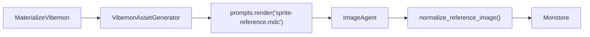
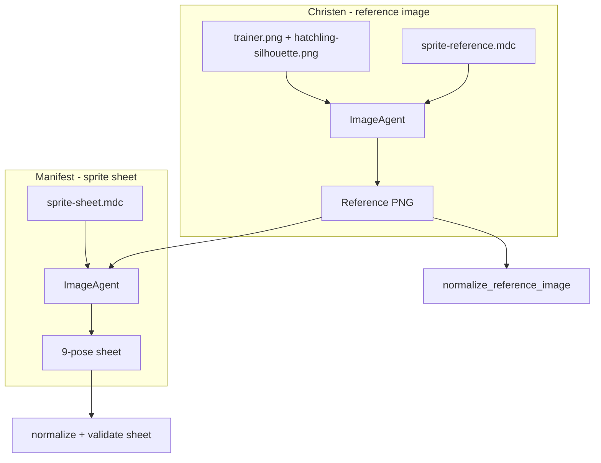
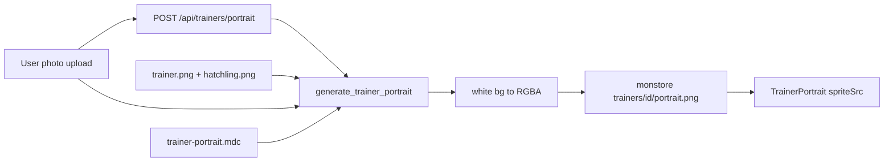

# Reference Style Pivot Plan

## Goal

Move GenAI sprite generation from Pokémon/Sugimori art direction to the validated **Goldilocks cozy-handheld** style anchored on `trainer.png` and `hatchling-silhouette.png`. Same PR also adds a **styled trainer portrait** prompt (required user likeness photo + style bible) and wires the existing `/api/trainers/portrait` stub.

## Summary

- Update Vibemon reference/sheet prompts with Goldilocks style + style-bible image attachment
- Sync `vibemon/frontend/asset-prompts/base-style.md` and inline endings in icon `.mdc` files
- Add `trainer-portrait.mdc` + pipeline for likeness-based trainer sprites
- Optional bulk v2 regen deferred to **Decision gate** at end of implementation

## Implementation checklist

- [ ] Add `_style/rendering.j2`, `_style/style-bible.j2`, `_style/trainer-gear.j2`, `_style/likeness.j2`; rewrite `base-style.md`; sync 3 icon `.mdc` endings
- [ ] Bundle style bible PNGs; attach in `generate_reference_image()`; add style-bible block to `sprite-reference.mdc`
- [ ] Rewrite `sprite-reference.mdc` (remove Sugimori/Pokemon, include style partials, bump version)
- [ ] Update `sprite-sheet.mdc` STYLE LOCK (no Sugimori re-lock); bump version
- [ ] Add `trainer-portrait.mdc`; `generate_trainer_portrait(likeness_bytes, username)`
- [ ] Wire `POST /api/trainers/portrait` — auth, validate upload, generate, store blob, return `portrait_url` on `PublicTrainerRead`
- [ ] `TrainerPortraitCamera.svelte` — session cookie, display returned portrait URL; loading/error states
- [ ] Add `asset-prompts/game/sprites/trainer.mdc` + `hatchling-silhouette.mdc`
- [ ] De-Pokemon `species-name.mdc` + `battle-cry.mdc` frontmatter/body
- [ ] Update `ASSET-PROMPTS.md` + `GEAR.md` concept-art anchor to Goldilocks wording
- [ ] Prompt snapshot tests; `generate_vibemon` spot-check; trainer portrait HTTP + generator tests
- [ ] **Decision gate:** ask user before any v2 bulk regen of monstore or frontend PNGs (see below)

---

## Current state

The reference image path is:



Key files:

- Generator entry: [`vibemon/backend/app/genai/vibemon_assets.py`](../../vibemon/backend/app/genai/vibemon_assets.py) — `generate_reference_image()` renders `sprite-reference.mdc`
- Prompt template: [`vibemon/backend/app/genai/prompts/sprite-reference.mdc`](../../vibemon/backend/app/genai/prompts/sprite-reference.mdc)
- Style bible (frontend): [`vibemon/frontend/asset-prompts/base-style.md`](../../vibemon/frontend/asset-prompts/base-style.md)
- Downstream sheet prompt: [`vibemon/backend/app/genai/prompts/sprite-sheet.mdc`](../../vibemon/backend/app/genai/prompts/sprite-sheet.mdc)

**Pokemon influence today** (what to remove/replace):

| Location | Current language |
| :--- | :--- |
| Opening line | "Pokémon-style creature" |
| `PALETTE & STYLE` | "Pokémon Sugimori — flat cel shading, warm gradient fills, Kodachrome-warmed" |
| `sprite-sheet.mdc` `STYLE LOCK` | "Match the reference image's Pokémon Sugimori style" |

**base-style anchor** (starting point — superseded by Goldilocks):

> Illustrative pixel art concept style; thick dark brown pixelated outlines; coarse watercolor-paper texture; grainy speckled wash shading (not flat pixels); muted desaturated palette; static detailed sprite pose.

**A/B test finding (OpenAI vs Gemini, Embertop prompt):**

| Trait | OpenAI (too far) | Gemini (too soft) | Style bible (`trainer.png`, `hatchling-silhouette.png`) |
| :--- | :--- | :--- | :--- |
| Shading | Heavy crosshatch/stipple filling every surface | Smooth cel gradients | 2–3 **flat tone steps** with gentle stepped edges |
| Texture | Grain IS the shading (crunchy, noisy) | Light paper overlay on smooth fills | **Whisper-level** grain; subtle dither on flat fields only |
| Detail density | High-res concept art micro-detail | Polished mascot illustration | **Cozy mid-detail** — simple shapes readable at 48–64px |
| Outlines | Thick, busy | Clean smooth ink | Thick Tobacco Brown, **pixel-rounded**, chunky |
| Proportions | Realistic dragon | Soft chibi | Chibi-leaning (trainer), organic but structured (hatchling) |

**Root cause — prompt base gaps (not just wording tweaks):**

1. **No style bible image attachment.** [`DESIGN.md`](../DESIGN.md) §5.1 says downstream generation should be seeded from the hero sprite reference sheet. `generate_reference_image()` is text-only; `generate_sprite_sheet_image()` already attaches a reference image. The canonical PNGs exist at [`trainer.png`](../../vibemon/frontend/static/game/sprites/trainer.png) and [`hatchling-silhouette.png`](../../vibemon/frontend/static/game/sprites/hatchling-silhouette.png) but are never passed to the model.

2. **`base-style.md` over-specifies texture vs DESIGN.md.** DESIGN §4: film grain is **screen-space post-process, never baked into sprites**. DESIGN §2.2 / icon prompts: **"subtle dither on flat surfaces"** — not heavy wash. Current base-style ("grainy speckled wash over entire image surface") pushes OpenAI into crosshatch overkill and still reads as "soft illustration" to Gemini.

3. **Missing scale/simplicity anchor.** DESIGN §5.1: **48–64px character sprites**, 320×180 canvas. No prompt mentions this — models default to high-res concept art scale.

4. **No `.mdc` provenance for style bible sprites.** Icons have [`asset-prompts/game/icons/*.mdc`](../../vibemon/frontend/asset-prompts/game/icons/); `trainer.png` and `hatchling-silhouette.png` have no prompt records, so the text anchor drifted away from what actually produced them.

5. **Icon prompts already hit closer to target.** [`camera.mdc`](../../vibemon/frontend/asset-prompts/game/icons/camera.mdc) uses calibrated language our creature prompt lacks: *"Subtle dither on flat surfaces"*, *"light grainy wash"*, *"no drop shadow baked into the sprite"*, *"cozy mid-century"*.

**Revised style target** (Goldilocks — between OpenAI crunch and Gemini softness):

> Cozy handheld pixel sprite for a 320×180 battle canvas. Chunky Tobacco Brown outlines, pixel-rounded forms, 2–3 flat tone steps per zone, whisper-level paper grain and subtle dither on large fills only. Locked muted mid-century palette. Simple readable silhouette at 48–64px scale — not high-res concept art, not heavy crosshatch, not smooth airbrush.

**Intentional divergence:** keep chroma-key matte backgrounds from `CANVAS RULES` — do **not** copy base-style's "solid white background" into creature prompts. UI icons in [`vibemon/frontend/asset-prompts/game/`](../../vibemon/frontend/asset-prompts/game/) keep white; generated Vibemon keep `{{ vibemon.aesthetic.background_color }}` for [`normalize_reference_image()`](../../vibemon/backend/app/workflows/_sprite_assets.py).

Also add an explicit rule: **paper texture and grain apply to creature fills only** — the matte background must stay a flat uniform wash (texture on the background would fight chroma keying).

**Validated approach (manual A/B):** Attach `trainer.png` + `hatchling-silhouette.png` as style references + Goldilocks text block. Google produces good results across Embertop, Glimshell, and Canopyne variants.

---

## What needs updating — scope matrix

### Must update (visual pipeline — same PR)

| File | Why |
| :--- | :--- |
| [`sprite-reference.mdc`](../../vibemon/backend/app/genai/prompts/sprite-reference.mdc) | Primary target — Sugimori/Pokemon language, missing style bible block, missing Goldilocks anchor |
| [`sprite-sheet.mdc`](../../vibemon/backend/app/genai/prompts/sprite-sheet.mdc) | `STYLE LOCK` still re-locks Sugimori; would undo new reference look during manifest |
| [`vibemon_assets.py`](../../vibemon/backend/app/genai/vibemon_assets.py) | Style bible attach on reference gen; **new `generate_trainer_portrait()`** |
| [`trainers.py`](../../vibemon/backend/app/http/routes/trainers.py) | Replace portrait upload stub with full gen + store pipeline |
| [`trainer/schema.py`](../../vibemon/backend/app/domains/trainer/schema.py) | Add optional `portrait_url` to `PublicTrainerRead` |
| **New:** [`trainer-portrait.mdc`](../../vibemon/backend/app/genai/prompts/trainer-portrait.mdc) | Styled trainer gen from required likeness + bible |
| [`TrainerPortraitCamera.svelte`](../../vibemon/frontend/src/lib/domains/trainer/TrainerPortraitCamera.svelte) | Wire response, loading/error, update displayed sprite |
| [`_style/rendering.j2`](../../vibemon/backend/app/genai/prompts/_style/rendering.j2) | Shared Goldilocks text (top + bottom of reference prompt; backup in sheet prompt) |
| [`_style/style-bible.j2`](../../vibemon/backend/app/genai/prompts/_style/style-bible.j2) | "Match attached style bible — style only, not characters" instruction block |
| [`base-style.md`](../../vibemon/frontend/asset-prompts/base-style.md) | Current wash language conflicts with DESIGN.md and validated Goldilocks wording |
| [`asset-prompts/game/icons/*.mdc`](../../vibemon/frontend/asset-prompts/game/icons/) (3 files) | Inline `base-style.md` endings must stay verbatim in sync when base-style rewrites |
| New: `app/genai/style_bible/*.png` | Bundle copies of trainer + hatchling so backend is self-contained at deploy |

**sprite-sheet.mdc — lighter touch than reference:** Already receives the **creature reference image** as primary style source via `REFERENCE LOCK`. Update `STYLE LOCK` to say *"Match the attached reference image's rendering style"* plus a short negative list. Do **not** re-attach style bible PNGs on sheet gen — the christened reference already encodes the look.

### Should update (same PR, trivial — branding consistency)

| File | Why | Change |
| :--- | :--- | :--- |
| [`species-name.mdc`](../../vibemon/backend/app/genai/prompts/species-name.mdc) | Still says "Pokémon-style monster" | → "Vibemon" framing — **no visual impact** |
| [`battle-cry.mdc`](../../vibemon/backend/app/genai/prompts/battle-cry.mdc) | Still says "Pokémon-style digital effect" | → "retro handheld synthesized creature cry" — audio only |

### Do not update (no visual/style impact)

| Files | Reason |
| :--- | :--- |
| `elements/*.j2` (18) | Anatomy, palette, motifs — not rendering medium |
| `roles/*.j2` (12) | Posture/attitude cues only |
| `tiers/*/visual.j2` (5) | Complexity/silhouette budgets |
| `tiers/*/sonic.j2` (5) | Battle cry duration/timbre — unrelated to sprites |
| [`_sprite_assets.py`](../../vibemon/backend/app/workflows/_sprite_assets.py) | Matting unchanged unless post-QA halos |
| [`prompts.py`](../../vibemon/backend/app/genai/prompts.py) | No loader changes needed |

### Optional (defer unless mythic QA shows glow)

| File | Issue |
| :--- | :--- |
| [`tiers/mythic/visual.j2`](../../vibemon/backend/app/genai/prompts/tiers/mythic/visual.j2) | "glowing elements" vs sprite no-aura rule — add *"luminance = lighter fills, not detached glow"* |

### Frontend `asset-prompts/` coverage

| File | Plan action |
| :--- | :--- |
| `base-style.md` | Rewrite to Goldilocks |
| `game/icons/camera.mdc`, `settings.mdc`, `vibe-deck.mdc` | Sync inline style block |
| **New** `game/sprites/trainer.mdc`, `hatchling-silhouette.mdc` | Retroactive provenance |
| `crew.png`, `trainer-field.png` (no `.mdc` yet) | **Not in plan** unless added separately |

Prompt text updates do **not** regenerate committed PNGs unless user opts in via Decision gate.

---

## Prompt flow after changes



---

## Recommended approach

### 1. Extract shared backend style partials (synced to base-style.md)

Add [`vibemon/backend/app/genai/prompts/_style/rendering.j2`](../../vibemon/backend/app/genai/prompts/_style/rendering.j2) — **Goldilocks** rendering block calibrated to `trainer.png` / `hatchling-silhouette.png` and [`DESIGN.md`](../DESIGN.md) §5.1:

```jinja
COZY HANDHELD SPRITE STYLE
- Design as a 48–64px-tall battle sprite on a 320×180 pixel canvas — chunky, simple, warm, readable, animatable.
- Thick #3D2B1F Tobacco Brown pixelated outlines with pixel-rounded forms. Keep silhouettes simple; avoid micro-detail.
- Shading: 2–3 flat tone steps per color zone with soft stepped edges — not airbrushed gradients, not heavy crosshatch.
- Texture: whisper-level only. Light paper grain plus subtle dither on large flat color fields. Do NOT fill entire surfaces with stipple or crosshatch. Do NOT bake film grain, vignette, or screen-space effects into the sprite.
- Locked mid-century muted palette (~16–24 colors). No neon saturation, no glossy plastic, no pure black.
- Chibi-leaning proportions: slightly large head, simple features, cozy handheld monster-battler feel.

DO NOT RENDER
- High-resolution concept art, HD-2D painterly sprites, or illustration-scale detail
- Heavy dither crosshatch, stipple noise filling color fields, or crunchy over-texturing
- Smooth airbrushed cel shading, mascot polish, Sugimori official art, or anime key art
- Drop shadows, glow, bloom, or gradients baked into the sprite
```

**Attach style bible images in `generate_reference_image()`:**

```python
style_refs = [
    pydantic_ai.BinaryImage(data=trainer_png_bytes, media_type="image/png"),
    pydantic_ai.BinaryImage(data=hatchling_png_bytes, media_type="image/png"),
    prompt.text,
]
result = await self._image_agent_client().run(style_refs)
```

Load PNGs from a bundled path (e.g. `app/genai/style_bible/`). Prompt text must say: *"Match the rendering style of the attached style bible images — do not copy their characters."*

**Rewrite `base-style.md`:**

```markdown
In a cozy handheld pixel art sprite style. Render with thick, distinct dark brown pixelated outlines defining the silhouette. Use 2–3 flat tone steps per color zone with soft stepped edges. Apply whisper-level paper grain and subtle dither on large flat surfaces only — not heavy crosshatch or stipple across entire fills. The color palette is slightly muted and desaturated. Isolated on a clean, solid white background, presented in a static, detailed sprite pose.
```

Do **not** read `base-style.md` at runtime from the frontend tree — backend uses Jinja `` from `prompts/`.

### 2. Rewrite `sprite-reference.mdc`

- Bump version (e.g. `1.0.0` → `1.1.0`); add `style_anchor: base-style.md`
- Replace Pokémon opening line with Vibemon framing
- Include `_style/rendering.j2` at top and bottom; keep palette hex rules from `COLORS.md`
- Add flat-matte chroma-key bullet to `CANVAS RULES`

### 3. Update `sprite-sheet.mdc`

Backup STYLE LOCK only — reference image is primary:

```jinja
STYLE LOCK
- Match the attached reference image's rendering style exactly — outline weight, shading steps, texture level, palette muting.
- Keep the reference palette. Do not introduce new body colors.
- Highlights stay inside the creature silhouette only.
- Do not draw detached elemental effects, speed lines, expression symbols, or decorative marks.
- Do NOT re-render as smooth airbrushed cel shading, Sugimori official art, heavy crosshatch, or illustration-scale detail.
```

Bump version (e.g. `1.6.0` → `1.7.0`).

### 4. Light branding pass

[`species-name.mdc`](../../vibemon/backend/app/genai/prompts/species-name.mdc) and [`battle-cry.mdc`](../../vibemon/backend/app/genai/prompts/battle-cry.mdc) — swap "Pokémon-style" for Vibemon framing.

### 5. New — styled trainer portrait prompt (same PR)

**Product hook:** [`TrainerPortraitCamera.svelte`](../../vibemon/frontend/src/lib/domains/trainer/TrainerPortraitCamera.svelte) posts to [`POST /api/trainers/portrait`](../../vibemon/backend/app/http/routes/trainers.py) — currently a **stub** (logs bytes, 204).

**Requirements (locked):**

- **User likeness photo is required** — no style-bible-only fallback
- **Style bible** sets rendering medium + default field-trainer pose/gear (match `trainer.png`)
- **User upload** sets face/hair/skin tone/build likeness only — not photo background or street clothes

**New prompt:** `trainer-portrait.mdc`

**Image attachment order:**

1. `trainer.png` — composition + gear bible
2. `hatchling-silhouette.png` — texture anchor
3. User likeness photo — likeness only
4. Rendered prompt text

**Key prompt blocks:** `_style/style-bible.j2`, `_style/likeness.j2`, `_style/trainer-gear.j2`, `_style/rendering.j2`

**GEAR LOCK (from trainer.png):** red/white cap, red vest with cream stripe, dark tee, blue jeans, red/white sneakers, yellow backpack straps, black wrist cuffs, closed Vibe Deck on right hip per [`GEAR.md`](../GEAR.md).

**API:** auth required; validate upload; generate; store at `trainers/{trainer_id}/portrait.png`; return `portrait_url` on `PublicTrainerRead` (200, not 204).

**Frontend:** credentials on upload; loading/error states; update `TrainerPortrait` `spriteSrc`.



### 6. Out of scope (unless user opts in via Decision gate)

- Element/role/tier `.j2` includes
- Bulk regen of `.generated/monstore` Vibemon blobs
- Bulk regen of `static/game/` PNGs from `asset-prompts/`
- Trainer pose sheets or battle animations
- Post-process grain/vignette (stays screen-space per DESIGN.md §4)

---

## Validation

1. **Prompt snapshot tests** — `sprite-reference.mdc` and `sprite-sheet.mdc` assert no Sugimori/Pokémon-style; assert Goldilocks phrases
2. **Manual Vibemon gen** — `uv run python scripts/generate_vibemon.py --form christened --provider music`
3. **Trainer portrait** — POST `/api/trainers/portrait` with test photo; assert 200 + `portrait_url`
4. **Full manifest spot-check** — one `--form manifested` run

---

## Risk summary

| Risk | Mitigation |
| :--- | :--- |
| Style drift between frontend icons and generated sprites | Shared `_style/rendering.j2` synced to `base-style.md`; document in ASSET-PROMPTS.md |
| Grain/texture bleeding into matte | Explicit "creature surface only" + flat-matte canvas rule |
| Chroma-key halos on textured edges | Validate with existing `remove_solid_background()` first |
| User photo drives wrong outfit/background | LIKENESS LOCK + GEAR LOCK partials |
| Portrait gen latency blocks onboarding | Loading state in UI |
| Existing christened Vibemon look outdated | Default: new materializations only — see Decision gate |

---

## Decision gate — ask user before closing (required)

After implementation and spot-check validation pass, **pause and ask the user** whether to run optional bulk regeneration. Do **not** start bulk regen unless the user explicitly opts in.

### Question 1 — Local monstore Vibemon assets (v2)

> **Regenerate all existing Vibemon blobs in `.generated/monstore` as v2 assets?**

- Default monstore path: `file://…/.generated/monstore` (see [`.env.example`](../../../.env.example) `VIBEMON_STORAGE__ASSETS`)
- Gitignored local dev store — christened/manifested blobs tied to `.generated/database/`
- **v2** = re-run `MaterializeVibemon` with new prompts/style bible for every Vibemon that already has assets
- Cost: significant GenAI API spend and time; requires a regen script if opted in

Options: **Yes, regenerate all** | **No, leave existing mons as-is**

### Question 2 — Frontend hand-authored PNGs (`asset-prompts` catalog)

> **Regenerate the committed PNGs documented in `vibemon/frontend/asset-prompts/`?**

- Prompt text updates happen in the PR regardless; this is about **re-running image generation**
- In scope if opted in: icons (`camera`, `settings`, `vibe-deck`); style bible sprites (`trainer`, `hatchling-silhouette`)
- Out of scope unless asked separately: `crew.png`, `trainer-field.png`
- Style bible sprite regen is **high impact** — attached to all downstream GenAI calls

Options: **Yes, regenerate all catalog PNGs** | **Icons only** | **No, prompt sync only (keep existing PNGs)**

### Agent behavior

1. Complete core plan (prompts, pipeline, tests, docs) first.
2. Present validation results briefly.
3. Ask the two questions above explicitly — do not bury in prose.
4. If user opts into monstore regen: implement/run regen script; report count regenerated vs skipped.
5. If user opts into frontend regen: regenerate via validated style-bible workflow; commit PNG + `.mdc` pairs.
6. If user declines both: note that existing assets remain v1 visually; only new generations use v2 prompts.

---

## Related docs

- [`ASSET-PROMPTS.md`](../ASSET-PROMPTS.md)
- [`DESIGN.md`](../DESIGN.md) §5.1 (style bible, sprite resolution)
- [`GEAR.md`](../GEAR.md) (trainer gear tokens)
- [`COLORS.md`](../COLORS.md)
